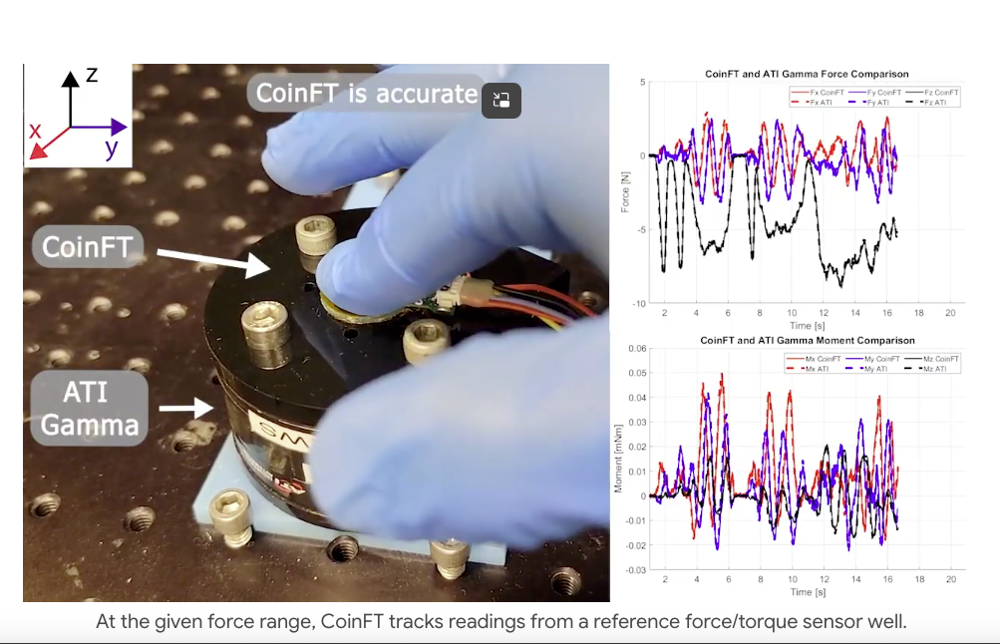
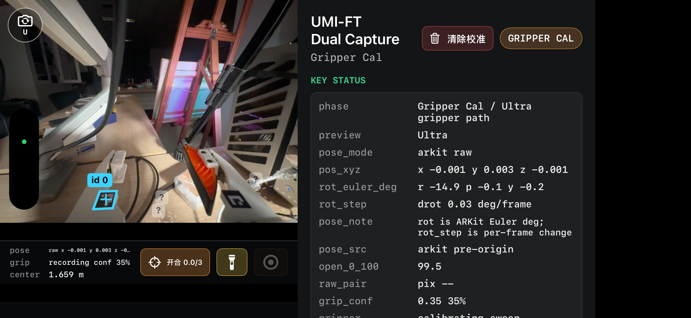
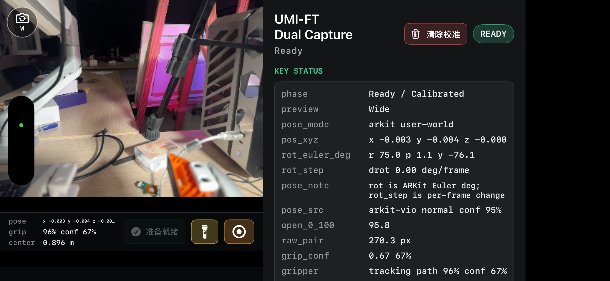
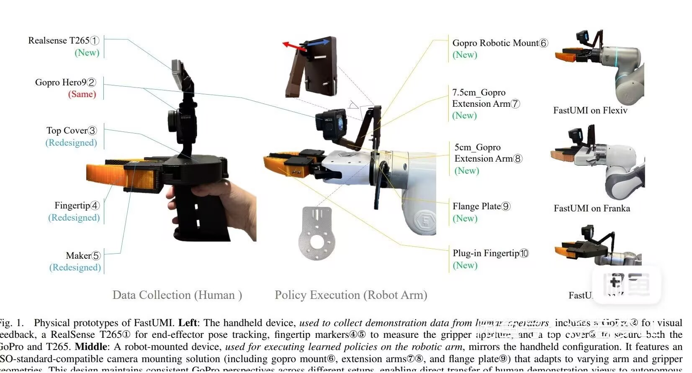
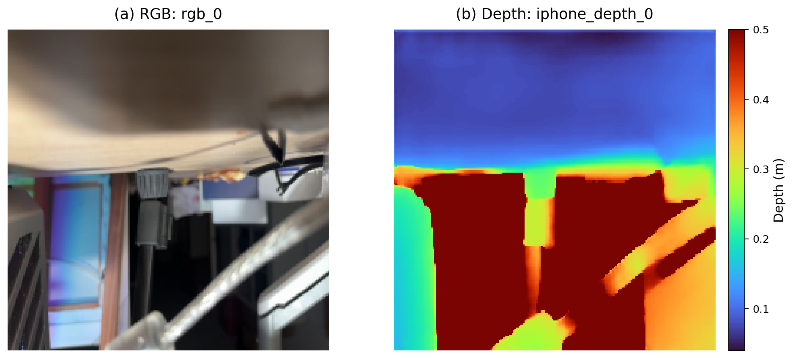

# 力控数据采集硬件选型与跨本体数采方案（V2）

1.1 数采路线选择

本项目早期使用过 3D Mouse，并将 Mobile Aloha 代表的主从臂方案作为主要对比路线。两种方法都能直接控制真实机器人，采集数据与执行本体之间的运动学差异较小，但在采集效率、设备复制和跨本体使用方面存在限制。原版 UMI 将操作者从真实机器人上分离出来，转而直接记录工具级视觉、位姿和夹爪动作，因此更适合作为本项目的大规模数采基础。

| 方案                  | 数据特点                                                 | 适合之处                                                   | 对本项目的主要限制                                                                               |
| --------------------- | -------------------------------------------------------- | ---------------------------------------------------------- | ------------------------------------------------------------------------------------------------ |
| 3D Mouse 遥操作       | 六维输入映射为真实机器人 TCP 增量                        | 直接操作目标机器人，动作空间一致，轨迹和训练数据质量较高   | 操作者需要持续进行坐标和姿态转换；精细任务熟练成本高；双臂操作负担进一步增加，单位时间采集量受限 |
| Mobile Aloha / 主从臂 | 主端关节运动映射到同构或近似同构从端                     | 关节语义直观，可直接得到特定本体控制数据                   | 主端与目标本体绑定，机构、关节和夹爪变化后需要重新适配；设备占用、复制成本和工作空间要求较高     |
| 原版 UMI              | 手持夹爪直接与真实物体交互，记录工具视觉、位姿和夹爪状态 | 操作自然，采集速度快，不依赖目标机器人关节结构，设备易复制 | 采集工具与机器人之间存在几何异构；原版方案没有接触力和夹持力数据                                 |

3D Mouse 并非被本项目否定。由于它直接驱动真实机械臂，本体和动作空间一致，早期拟合和训练仍大量采用 3D Mouse 数据。UMI 数据更适合快速扩充任务和场景分布，3D Mouse 数据则适合提供本体对齐程度更高的精细样本，两类数据在项目中具有互补关系。

### 1.2 原版 UMI 及其力控能力缺口

UMI（Universal Manipulation Interface）采用带夹爪和腕部相机的手持工具。操作者脱离真实机器人，直接使用该工具完成接近、抓取、移动和双手协作；系统记录工具附近视觉、六自由度位姿和连续夹爪动作，并将结果表达为工具 TCP 或相对 TCP 运动。

```text
操作者手持夹爪完成任务
  -> 腕部视觉和惯性信息恢复工具位姿
  -> 指端 marker 记录夹爪开度
  -> 生成工具 TCP 轨迹或相对动作
  -> 目标机器人根据自身 TCP、IK 和夹爪接口执行
```

<p align="center">
  
</p>
<p align="center"><em>图 1　原版 UMI 手持夹爪、腕部视觉和夹爪宽度跟踪结构。</em></p>

UMI 适合大规模采集的原因在于：操作者直接移动工具，动作连续自然；采集过程不必占用真实机器人；数据以 TCP 和相对运动表示，不依赖某一机器人关节结构；采集工具也可以通过法兰、相机支架和指端安装件适配不同末端。

原版 UMI 面向视觉模仿学习设计，主要记录视觉、位姿和夹爪状态。用于力控任务时，它不能直接给出：

- 接触开始、保持和结束时的真实受力；
- 法向力、剪切力以及接触力矩；
- 左右指端夹持力是否平衡；
- 插入、擦拭、压合和滑动过程中的力变化；
- 碰撞、卡滞和滑移等瞬态事件。

仅根据图像或位姿变化推测接触，无法为力位混合策略提供稳定的监督信号。因此，本项目没有改变 UMI 的手持交互主线，而是在其指端和数据链路上补足力觉。

### 1.3 本项目整体硬件方案

本项目采用“一套手持端、两类视觉、双指力觉、一个统一接收端”的整体结构：

| 组成           | 选型                     | 作用                                                                 |
| -------------- | ------------------------ | -------------------------------------------------------------------- |
| 手持工具       | 改版 UMI 3D 打印平行夹爪 | 提供接近机器人末端的操作形态，形成稳定 TCP 和夹爪开合结构            |
| 局部视觉与位姿 | iPhone                   | 采集夹爪第一视角、ARKit 六自由度位姿、夹爪 marker 和录制事件         |
| 指端力觉       | 左右两个 CoinFT          | 分别记录两侧六维力/力矩，覆盖夹持力和外部接触力                      |
| 力觉转发       | Teensy 4.1               | 同步读取两路 CoinFT，并通过 USB 将高频数据转发到笔记本               |
| 全局视觉       | D435/D435i               | 从固定视角记录工作区 RGB 和 Depth，补充腕部视角遮挡和场景上下文      |
| 统一接收端     | Mac 笔记本               | 管理设备、Dataset 和 Episode，完成预览、时间戳记录、对齐和 Zarr 导出 |

<p align="center">
  
</p>
<p align="center"><em>图 2　本项目改版 UMI 手持端：iPhone、3D 打印夹爪和左右指端 CoinFT。</em></p>

相较原版 UMI，本项目主要完成五项结构改动：

1. 用 iPhone 替换 GoPro，将 RGB、深度能力、IMU、ARKit 位姿、夹爪识别和采集控制集中在同一移动节点。
2. 在左右指端内侧增加 CoinFT 安装位，使传感器靠近物体实际接触面。
3. 重新设计手机支架，使目标、指端和夹爪 marker 能够同时进入有效视野，并固定手机到 TCP 的安装外参。
4. 增加传感器保护、线缆固定和后方握持结构，尽量分离人手握持力与物体接触力。
5. 增加固定 D435/D435i 全局 RGB-D，相机与手机第一视角共同描述任务现场。

### 1.4 CoinFT 力觉选型与指端安装

ATI Gamma 等商用六维力/力矩传感器通常采用金属弹性体和法兰结构，适合安装在机器人腕部，能够测量整个工具的合力。但是其体积、厚度和重量不适合同时安装在手持夹爪的两个指端；两套腕部传感器还会显著增加夹爪宽度、重心偏移、转接件和布线复杂度。

CoinFT 将电容式弹性结构压缩到硬币尺寸。外力作用后，上下 PCB 之间发生微小位移和转动，引起多组电极之间的电场和电容变化。标定阶段使用参考六维传感器提供真实标签，训练小型 MLP 模型学习多通道电容变化到真实 wrench 的非线性映射；在线阶段由模型输出：

```text
[Fx, Fy, Fz, Mx, My, Mz]
```

<p align="center">
  
</p>
<p align="center"><em>图 3　CoinFT 与 ATI Gamma 的尺寸和测量响应对比。</em></p>

CoinFT 体积和质量较小，可以在两个指端分别安装。左右独立测量能够区分内部夹持力、外部接触力、偏心夹持和单侧先接触，并记录插入、擦拭、摩擦和滑移过程中的力矩变化。

<table>
  <tr>
    <td width="42%" align="center"></td>
    <td width="58%" align="center"></td>
  </tr>
</table>
<p align="center"><em>图 4　CoinFT 指端安装以及外部接触力、内部夹持力响应。</em></p>

CoinFT 直接观测的是电容变化，六维力是标定模型的估计结果。因此，数据中必须保留传感器编号、tare 状态、模型版本、坐标系和单位。传感器没有独立外壳，安装位置和固定螺钉预紧力的细微变化都会影响零点；完成安装和标定后，严禁操作者移动、拆卸或自行调整 CoinFT。

### 1.5 iPhone、全局视觉与笔记本

iPhone 将原版 UMI 中分散的相机、惯性测量和采集控制集中到一个容易获得的消费级设备中：RGB 相机记录目标、指端和接触区域；ARKit 融合视觉和 IMU 输出手机位姿；marker 识别给出连续夹爪开度；App 的录制事件用于划分电脑端三路数据的 Episode。

手机与夹爪刚性固定后，采集 TCP 位姿为：

```text
T_world_tcp(t) = T_world_phone(t) · T_phone_tcp
```

其中 `T_phone_tcp` 是安装完成后固定的手机到夹爪 TCP 外参。

<table>
  <tr>
    <td width="50%" align="center"></td>
    <td width="50%" align="center"></td>
  </tr>
</table>
<p align="center"><em>图 5　iPhone 端实际界面：夹爪开度校准和完成校准后的 Ready 状态。</em></p>

D435/D435i 固定在工作台侧方或上方，补充任务整体、操作者和双臂相对关系。笔记本统一接收 iPhone、D435 和 CoinFT，记录各路原始时间戳和 Episode 事件，并在采集结束后完成时间对齐、TCP 转换和标准格式导出。连续位姿、夹爪和力觉按时间戳插值，图像按最近时间戳匹配，原始高频力觉不会因训练导出而被删除。

## 2. 基本操作方式说明

本节只说明正常采集所需的基本步骤。具体按钮截图、操作要点和异常处理见《力控数据采集设备基本操作说明》。

### 2.1 开始前准备

通电前检查手机、夹爪、CoinFT 和指端固定件，确认结构无松动；清洁手机、marker 和 D435/D435i 镜头；固定线缆并保留手腕转动余量。D435/D435i 应能看到完整工作区，采集过程中不得再移动相机。场景光照应保持稳定，并保留桌面边缘、文字或物体纹理，避免手机画面长时间只包含白墙或纯色表面。

接线顺序为：

```text
D435/D435i 接入笔记本
  -> Teensy/CoinFT 接入笔记本
  -> iPhone 通过 USB 接入、解锁并信任电脑
  -> 启动笔记本端服务并选择 Dataset
  -> 点击 Arm All
```

`Arm All` 只启动并连接三路设备，不开始正式 Episode。进入校准前，电脑端应同时看到 iPhone 画面、D435/D435i 画面和左右 CoinFT 曲线。

<p align="center">
  
</p>
<p align="center"><em>图 6　点击 Arm All 后，iPhone、D435 和左右 CoinFT 同时在线。</em></p>

### 2.2 单臂操作

单臂采集使用一套手持设备。操作者握住夹爪后方把手，使手掌位于手机镜头后方，不遮挡镜头、marker 和指端。正式采集前保持夹爪空载，完成 CoinFT 清零；随后在手机端完成多次全开—全闭的夹爪校准和工作台世界坐标标定，等待手机显示 `Ready / Calibrated`、电脑端 `Gate` 显示 `ready`。

开始一条数据时，在 iPhone 端点击录制按钮，倒计时结束后再执行动作。自由空间可以按任务自然速度移动，接近和接触目标前主动减速；任务完成后先释放物体并退出接触，保持约 `1～2 s`，再由 iPhone 结束 Episode。电脑端出现 `record_stop_committed` 后，可以直接开始下一条，无需重新点击 `Arm All`。

### 2.3 双臂操作

双臂采集使用两套相同设备，分别编号为 `left` 和 `right`。左手和右手各握持一套，硬件结构、校准和操作方法与单臂相同。开始前必须确认两侧均进入 Ready，两套设备共同使用同一个 Dataset、Task 和 Episode 标识。

双手动作应在倒计时结束后开始，交接、共同接触和相互避让在同一 Episode 中连续完成。任一侧掉线、持续遮挡、碰撞或力觉异常时，两侧都停止，当前 Episode 不作为正常数据保留。

### 2.4 力觉与结构保护

正常采集应使用完成任务所需的最小有效力，任一 CoinFT 三轴合力建议保持在 `10 N` 以内，不进行大量或持续的超 `10 N` 操作；任一指端绝对不得超过 `50 N`。不得用夹爪敲击、撞击或侧向撬动物体。

严禁移动、拆卸或调整 CoinFT 及其固定螺钉。采集过程中如发现夹爪完全空载时读数明显不为 `0 N`，应先结束当前 Episode，然后在电脑端依次点击 `Stop` 和 `Arm All` 重置。重置后仍不归零时停止使用，由维护人员检查传感器和安装结构。

## 3. 跨本体数采方法

### 3.1 本体无关 UMI 数采

本项目采集的是工具级数据，而不是某一台机器人专属的关节角。每套手持端记录：

- 夹爪第一视角 RGB 和深度；
- 固定全局 RGB-D；
- 采集 TCP 六自由度位姿；
- 连续夹爪开度；
- 左右指端六维力/力矩；
- Dataset、Episode 和各设备时间戳。

为减少采集场景世界原点和机器人 base 的影响，动作可以用当前 TCP 坐标系下的相对变换表示：

```text
DeltaT(t, k) = inverse(T_world_tcp(t)) · T_world_tcp(t + k)
```

同一操作在不同场景中只要保持目标与夹爪的相对关系相近，其相对动作语义就保持一致。目标机器人只需根据自身 base、TCP 和逆运动学将工具动作转换为关节命令，不需要复制采集者的手臂运动学。

### 3.2 跨本体遥操作

实时遥操作沿用相同的工具级表达。开始时分别记录采集端舒适零位和目标机器人安全等待位，后续只映射采集 TCP 相对初始位姿的变化：

```text
采集端 pose / gripper
  -> 采集 TCP 与初始零位
  -> 相对位姿增量和轴向转换
  -> 平移尺度、速度和加速度限制
  -> 目标机器人 TCP 与夹爪目标
  -> IK / 笛卡尔控制和安全门控
```

| 目标本体          | 适配内容                                                                                         |
| ----------------- | ------------------------------------------------------------------------------------------------ |
| X-Arm 单臂        | 标定 base 到目标 TCP、采集 TCP 到目标 TCP 的轴向关系；调用单臂笛卡尔或 IK 接口；映射目标夹爪开度 |
| 松灵/方舟移动双臂 | 左右臂分别建立 TCP 适配器；增加双臂间距、自碰撞和同步检查；第一阶段可固定底盘，只映射左右末端    |

每一帧遥操作目标都应检查设备在线状态、时间戳新鲜度、TCP 工作空间、姿态变化、速度、加速度、关节限位、逆运动学可解性、碰撞和急停状态。检查失败时，机器人保持上一安全目标或停止，不继续累积未执行的采集端位移。

远端机器人若具备腕部或指端力觉，可以将六维 wrench 曲线、力方向和超限状态显示在操作者界面中，用于修正后续动作；该反馈与采集端数据使用相同的 TCP 力觉语义。

### 3.3 末端夹爪本体对齐

跨本体使用不是简单复制一组位置数值，而是对齐采集工具和目标机器人的末端语义，包括几何、夹爪和力觉三部分。

**几何对齐。** 固定手机到采集 TCP 外参 `T_phone_tcp`，再标定采集 TCP 与目标 TCP 的轴向、工具长度和初始姿态。部署时使用采集端相对运动，不要求两个系统的世界原点重合。

**夹爪对齐。** 采集夹爪宽度先归一化：

```text
g = clamp((w_capture - w_capture_min) /
          (w_capture_max - w_capture_min), 0, 1)
```

平行目标夹爪再按自身行程映射：

```text
w_target = w_target_min + g · (w_target_max - w_target_min)
```

如果目标末端不是平行夹爪，则由该本体的夹爪适配器解释 `g`，不能直接复制物理宽度。

**力觉对齐。** 左右 CoinFT 原始 wrench 先保留在各自传感器坐标系中，再通过固定旋转和平移关系变换到指端或 TCP/tool 坐标系。变换时需要同时考虑坐标轴方向和力矩参考点，左右两路分别保存，不在原始层提前融合。

<p align="center">
  
</p>
<p align="center"><em>图 7　通过法兰、相机支架和指端结构保持工具视觉与 TCP 语义一致。</em></p>

对齐完成后至少进行三项检查：沿采集 TCP 的 X/Y/Z 正方向移动，确认目标 TCP 方向和尺度；分别绕 X/Y/Z 转动，确认姿态轴映射；分别在左右指端施力，确认左右通道、力方向和力矩符号没有交换。

### 3.4 单臂与双臂数据组织

单臂使用一套采集端和一个 `arm_id`。双臂直接复制两套设备，分别标记为 `left/right`，并共享 Dataset、Episode 边界和统一时间基准：

```text
episode_id
├── arm_left
│   ├── rgb / depth / pose / gripper
│   └── wrench_finger_left / wrench_finger_right
└── arm_right
    ├── rgb / depth / pose / gripper
    └── wrench_finger_left / wrench_finger_right
```

“双指力觉”表示同一个夹爪左右两个指端，不等于“双臂”。双臂条件下，两套夹爪共形成四路指端 CoinFT，必须同时记录设备编号、手臂编号和传感器侧别。

## 4. 数据格式说明

### 4.1 数据分层与时间组织

每个浏览器 Dataset 对应一个 `runs/run_*` 目录。数据按用途分层保存：

```text
runs/run_<time>_<task>/
├── RUN_MANIFEST.json
├── raw/          # iPhone、D435、CoinFT 原始输出
├── normalized/   # 字段和时间戳标准化，不统一重采样
├── aligned/      # Episode 时间轴、插值和最近帧匹配
├── exports/      # 项目 replay-buffer Zarr
└── logs/         # 运行、同步和质量日志
```

各路原始数据保留独立时间戳和原始频率。训练导出以约 `30 Hz` 的视觉/位姿时间轴为主，连续位姿、夹爪和力觉按时间戳插值，RGB 和 Depth 按最近时间戳匹配；约 `200 Hz` 的 CoinFT 原始序列仍独立保存，不因主时间轴对齐而被删除。

最终 Zarr 以 Episode 分组：

```text
acp_replay_buffer_gripper.zarr/
├── data/
│   ├── episode_0/
│   ├── episode_1/
│   └── ...
└── meta/
```

其中 `T` 表示视觉/位姿主时间轴长度，通常约为 `30 Hz × Episode 时长`；`F` 表示力觉时间轴长度，通常约为 `200 Hz × Episode 时长`，因此 `T` 与 `F` 不要求相等。

### 4.2 视觉数据

下图不是界面截图，而是直接从实际导出的 Zarr `runs/full_v2_recording_forced_origin_test/run_20260805_forced_origin_e2e_retry/exports/umift_replay_buffer_zarr/acp_replay_buffer_gripper.zarr` 中读取同一 Episode 时刻的 `rgb_0` 和 `iphone_depth_0` 后渲染得到。RGB 保留原始颜色值，Depth 使用米制数值着色，颜色条对应当前导出的深度范围。

<p align="center">
  
</p>
<p align="center"><em>图 8　实际 Zarr 的 RGB 与深度：`episode_0` 第 95 帧，左为 `rgb_0`，右为 `iphone_depth_0`，深度单位为 m。</em></p>

| 字段               | 完整 shape        | dtype       | 维度含义                                           | 数值范围与单位               | 频率                                               |
| ------------------ | ----------------- | ----------- | -------------------------------------------------- | ---------------------------- | -------------------------------------------------- |
| `rgb_0`          | `(T,224,224,3)` | `uint8`   | `[time,height,width,channel]`；通道顺序 R、G、B  | 每通道`[0,255]`            | 导出约`30 Hz`；iPhone 原始流为 `1920×1440@30` |
| `iphone_depth_0` | `(T,224,224,3)` | `float16` | iPhone 深度，兼容训练接口时同一深度值复制为 3 通道 | m；当前配置裁剪至`[0,0.5]` | 对齐到视觉主时间轴，约`30 Hz`                    |
| `rgb_global_0`   | `(T,224,224,3)` | `uint8`   | D435/D435i 全局 RGB，R、G、B 三通道                | `[0,255]`                  | 原始和导出约`30 Hz`                              |
| `depth_0`        | `(T,224,224,3)` | `float16` | D435/D435i 深度；同一深度值复制为 3 通道           | m；当前配置裁剪至`[0,0.5]` | 原始和导出约`30 Hz`                              |

视觉中的 `224×224` 是训练导出尺寸，不是传感器原始分辨率。原始视频、相机时间戳和深度仍保存在 `raw/`，可以根据新的训练配置重新裁剪和导出。

### 4.3 位姿与夹爪数据

| 字段                    | 完整 shape | dtype       | 各维含义                | 数值范围与单位                                                                                | 频率        |
| ----------------------- | ---------- | ----------- | ----------------------- | --------------------------------------------------------------------------------------------- | ----------- |
| `ts_pose_fb_0`        | `(T,7)`  | `float64` | `[x,y,z,qw,qx,qy,qz]` | `x,y,z` 单位 m，工程有效范围由采集工作空间确定；四元数单分量位于 `[-1,1]`，整体范数约为 1 | 约`30 Hz` |
| `gripper_0`           | `(T,1)`  | `float64` | 连续夹爪宽度            | m；当前线性映射范围约`[0,0.08]`                                                             | 约`30 Hz` |
| `robot_time_stamps_0` | `(T,1)`  | `float64` | 位姿/夹爪对应时刻       | s；以 Episode 起点附近为时间原点，单调递增                                                    | 约`30 Hz` |

`ts_pose_fb_0` 表示采集夹爪中心 TCP 在该 Episode 世界坐标中的位姿，不是某一目标机器人 base 坐标中的绝对末端位姿。跨场景和跨本体训练优先使用窗口内相对变换，从而消除不同世界原点带来的常量变换。

### 4.4 力觉数据

每个 CoinFT 输出六维 wrench，顺序固定为：

```text
[Fx, Fy, Fz, Mx, My, Mz]
```

| 字段                      | 完整 shape | dtype       | 各维含义                                      | 数值范围与单位                          | 频率         |
| ------------------------- | ---------- | ----------- | --------------------------------------------- | --------------------------------------- | ------------ |
| `wrench_left_coinft_0`  | `(F,6)`  | `float64` | 左指端 CoinFT 原坐标系`[Fx,Fy,Fz,Mx,My,Mz]` | 力 N，力矩 N·m；模型输出不做统一硬裁剪 | 约`200 Hz` |
| `wrench_right_coinft_0` | `(F,6)`  | `float64` | 右指端 CoinFT 原坐标系六维力/力矩             | 同上                                    | 约`200 Hz` |
| `wrench_left_0`         | `(F,6)`  | `float64` | 左指端数据变换到 TCP/tool 坐标系              | 力 N，力矩 N·m                         | 约`200 Hz` |
| `wrench_right_0`        | `(F,6)`  | `float64` | 右指端数据变换到 TCP/tool 坐标系              | 力 N，力矩 N·m                         | 约`200 Hz` |
| `wrench_concat_0`       | `(F,12)` | `float64` | `[left_Fx...left_Mz,right_Fx...right_Mz]`   | 前 6 维为左指端，后 6 维为右指端        | 约`200 Hz` |
| `wrench_time_stamps_0`  | `(F,1)`  | `float64` | 双路力觉样本时间                              | s；Episode 内单调递增                   | 约`200 Hz` |

力觉模型输出本身不以软件固定范围截断。工程使用时，任一指端三轴合力建议不超过 `10 N`，绝对不得超过 `50 N`；官方标定覆盖参考约为法向 `25 N`、剪切 `20 N`、力矩 `0.5 N·m`，该标定覆盖不等同于设备过载能力。读数饱和、突跳、空载不归零或超过操作限制时，相应 Episode 判为无效。

### 4.5 时间戳、Episode 与单双臂命名

| 数据                                              | 类型                     | 含义                                                |
| ------------------------------------------------- | ------------------------ | --------------------------------------------------- |
| `rgb_time_stamps_0`、`depth_time_stamps_0` 等 | `float64` 数组，单位 s | 各模态独立时间轴，不依靠数组下标假设同步            |
| `map_to_d_idx_0`                                | `(T,1) int64`          | 主视觉样本对应的最近深度帧索引                      |
| `record_start` / `record_stop`                | 原始事件记录             | 由 iPhone 发出，定义一条正式 Episode 的开始和结束   |
| `RUN_MANIFEST.json`                             | JSON                     | 保存 Dataset、Episode、设备配置、文件位置和处理状态 |

单臂字段使用机器人索引 `_0`。双臂导出时分别使用 `_0/_1` 或显式 `left/right` 映射，并在 manifest 中固定左右关系；同一 Episode 的两套设备必须共享开始/结束事件和统一时钟映射。每套夹爪内部仍保留 `wrench_left/right` 两个指端字段，不能把“指端左右”和“机械臂左右”混用。

完成导出后，应同时检查图像、TCP 位姿、夹爪宽度和力觉曲线。画面中建立接触时，力觉应出现对应变化；夹爪开合时，宽度曲线应同步变化；工具移动时，位姿应连续。出现缺帧、位姿跳变、marker 丢失、力觉饱和或关键模态错位时，应剔除该 Episode。

<p align="center">
  
</p>
<p align="center"><em>图 9　单条 Episode 中视觉、TCP 位姿、夹爪宽度和力觉沿时间轴的对应关系。</em></p>
