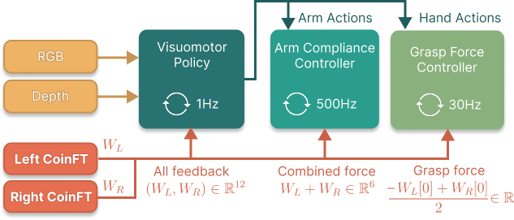
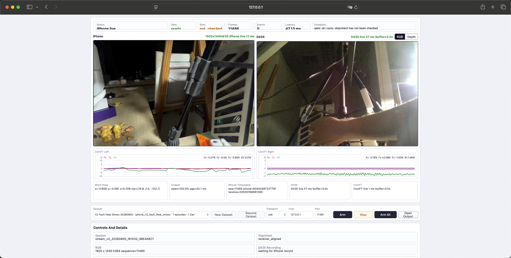
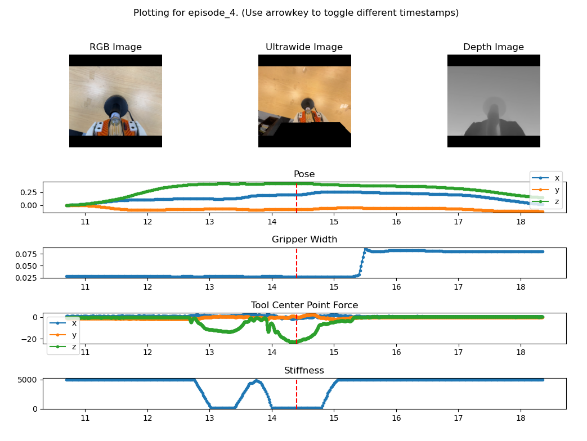
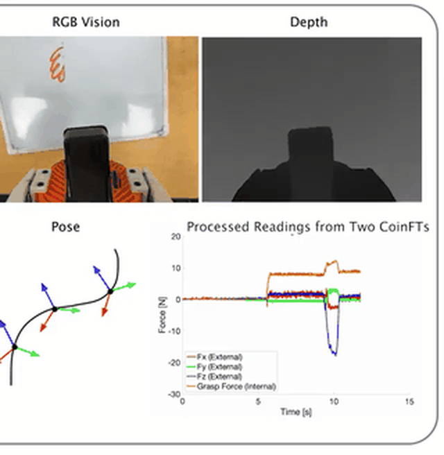
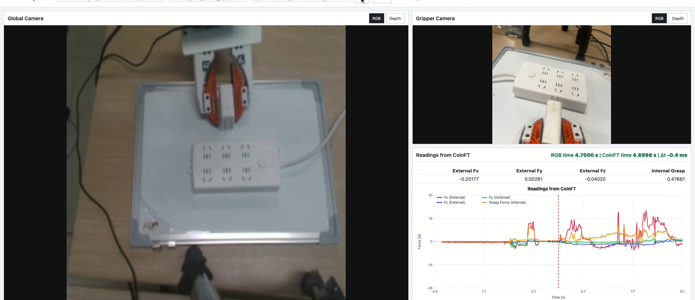

22b12

# 跨本体力控数据采集系统代码说明与测试报告

本文档说明跨本体力控数据采集系统的软件组成、源代码结构、主要模块、首次部署方法、运行流程、数据格式及测试结果。文档面向代码接收、系统部署和验收人员，目标是使接收方能够从交付代码出发完成环境检查、设备联接、数据采集、Episode 处理和结果验证。

本系统由 iPhone 手持采集端、D435/D435i 全局视觉、CoinFT/Teensy 力觉链路和笔记本端采集协调程序组成。各设备以自身频率持续采样，笔记本端以 iPhone 录制事件划分有效 Episode，并依次完成原始数据保存、时间对齐、坐标转换和训练格式导出。现场握持、接触和力限制见《力控数据采集设备基本操作说明》，本文重点说明软件如何组织和验证这些数据。

## 1. 系统组成与软件主线

### 1.1 系统输入与输出

系统同时接收三类设备数据：

| 数据来源    | 主要数据                                             |     标称频率 | 在系统中的作用                        |
| ----------- | ---------------------------------------------------- | -----------: | ------------------------------------- |
| iPhone      | 第一视角 RGB、ARKit 六自由度位姿、夹爪开度、录制事件 |  约`30 Hz` | 提供末端视觉、运动轨迹和 Episode 边界 |
| D435/D435i  | 固定全局 RGB 和 Depth                                |  约`30 Hz` | 提供场景上下文和全局深度信息          |
| 左右 CoinFT | 两路六维力/力矩                                      | 约`200 Hz` | 记录左右指端夹持力和外部接触力        |

笔记本端接收三路数据后，不在采集 receiver 内直接生成某一种训练格式，而是先忠实保存设备输出，再通过独立的对齐和导出模块生成训练数据。这样既保留了重新处理的可能，也避免训练字段变化反向影响原始采集链路。



图 1 多频率数据采集与同步结构

### 1.2 软件运行主线

系统运行过程如下：

```text
iPhone RGB / pose / gripper / event
D435 RGB-D
CoinFT left/right wrench
        |
        v
三路接收、实时预览和带时间戳缓冲
        |
        v
Dataset / Episode 编排与录制门控
        |
        v
raw 原始数据落盘
        |
        v
normalize -> align -> transform
        |
        v
UMI-FT replay buffer Zarr
        |
        +--> 模型训练和数据回放
        +--> 跨本体 TCP / 夹爪适配
```

这里需要区分“设备采集”和“Episode 录制”。点击浏览器 `Arm All` 后，iPhone、D435 和 CoinFT 已经开始持续采集，最近数据进入预览和环形缓冲区；iPhone 的 `record_start` 和 `record_stop` 只负责声明某一时间段属于当前有效 Episode。该机制能够保留录制事件前的短时 pre-roll，也使多条 Episode 之间不必反复重启设备。

## 2. 项目文件结构

### 2.1 项目根目录

交付代码按设备和处理职责分为四个主要模块：

```text
UMIFT-datacollect/
├── modules/
│   ├── 01_global_camera/           # D435/D435i 运行库和采集支持
│   ├── 02_iphone_gripper/          # iPhone App、ARKit 和夹爪视觉
│   ├── 03_coinft_teensy/           # CoinFT、Teensy、标定和采集工具
│   └── 04_laptop_alignment_export/ # 笔记本端主程序、对齐、导出和测试
├── docs/                           # 项目设计、操作和交付文档
├── runs/                           # 本地 Dataset 和 Episode 数据
└── show/                           # 汇报图片和多模态可视化资源
```

`modules/` 是正式源代码区域；`runs/` 是程序运行后生成的数据目录，不属于源码。编译缓存、`__pycache__`、`.deriveddata`、临时预览和本机日志也不应作为核心源码交付。

### 2.2 iPhone 采集端

iPhone App 位于：

```text
modules/02_iphone_gripper/ios_app/UMIFTiPhoneCaptureCore/
├── App/
│   ├── ARCapture/          # ARKit 图像和位姿采集
│   ├── Calibration/        # 世界坐标和设备运动校准
│   ├── Encoding/           # H.264 视频编码
│   ├── GripperVision/      # marker 检测和夹爪开度估计
│   ├── Recording/          # Episode 状态和本地缓冲
│   ├── Transport/          # Protocol V2、可靠传输和 ACK
│   ├── AppState/           # App 运行状态
│   └── UI/                 # Calibration、Ready 和 Recording 页面
└── UMIFTiPhoneCaptureCore.xcodeproj
```

`ARCapture/` 负责获取相机帧和 ARKit 位姿，`GripperVision/` 根据夹爪两侧 marker 估计开度，`Encoding/` 将主视角编码为 H.264，`Transport/` 将视频、位姿、深度索引和录制事件发送到笔记本。录制按钮产生的 `record_start` 和 `record_stop` 是笔记本端划分三路 Episode 的主要控制事件。

### 2.3 CoinFT 与 Teensy

CoinFT 和 Teensy 相关代码位于：

```text
modules/03_coinft_teensy/
├── scripts/       # 原始采集、标定和辅助脚本
├── configs/       # 设备及采集配置
├── artifacts/     # 标定模型和标定结果
├── steps/         # 固件烧录、标定和首次采集步骤
└── docs/          # CoinFT 链路说明
```

每个 CoinFT 的原始电容观测经过该传感器对应的归一化参数和小型标定模型，得到 `[Fx, Fy, Fz, Mx, My, Mz]` 六维力/力矩。Teensy 同时读取左右传感器并通过 USB 串口转发，笔记本端根据硬件编号分别加载左右标定模型。

CoinFT 本体没有独立保护外壳，安装位置和螺钉预紧力会影响零点。左右硬件编号、模型文件和实际安装位置必须保持一致，操作者不得移动、拆卸或调整传感器和固定螺钉。

### 2.4 笔记本端主程序

笔记本端代码位于 `modules/04_laptop_alignment_export/`：

```text
modules/04_laptop_alignment_export/
├── entrypoints/                    # 可直接执行的程序入口
├── umift_laptop_alignment/
│   ├── app/                        # Web GUI 后端和主控制程序
│   ├── capture/
│   │   ├── buffers/                # 通用带时间戳环形缓冲区
│   │   └── receivers/
│   │       ├── iphone/             # iPhone Protocol V2 接收
│   │       ├── d435/               # D435/D435i 采集和缓冲
│   │       └── coinft/             # CoinFT 串口、标定和缓冲
│   ├── orchestration/              # Dataset、Episode 和录制事件
│   └── pipeline/
│       ├── disk/                   # Episode 窗口落盘
│       ├── alignment/              # 多路时间对齐
│       ├── transforms/             # 各模态标准化和坐标变换
│       ├── inspect/                # 数据目录和 Episode 检查
│       ├── postprocess/            # 后处理编排
│       └── export/                 # 插件式训练格式导出
├── config/export_profiles/         # 导出配置
├── tests/                          # 自动化测试
├── docs/                           # 操作、协议和开发文档
└── legacy/                         # 历史实现和兼容代码
```

`entrypoints/` 中的文件是可直接执行的薄入口，正式实现位于 `umift_laptop_alignment/`。`legacy/` 仅用于历史兼容，不再增加新功能。该划分使设备协议、运行编排和训练格式彼此独立，便于后续替换某一路设备或增加新的导出格式。

## 3. 主要代码模块说明

### 3.1 程序入口和 Web 管理界面

笔记本端主入口为：

```text
entrypoints/receiver_web_gui.py
  -> umift_laptop_alignment/app/receiver_web_gui.py
```

入口文件通过 `_bootstrap.py` 将模块目录加入 Python 搜索路径，再调用正式 GUI 后端。GUI 后端负责创建 HTTP 服务、处理页面命令、启动三路采集、维护运行状态并向浏览器广播结果。

浏览器主要使用两个接口：

- `/state`：读取 iPhone、D435、CoinFT、Gate、Alignment、录制状态和后处理状态。
- `/main/command`：提交 `arm_all`、`stop_capture`、Dataset 管理和导出等命令。

GUI 本身不直接解析传感器协议，也不直接决定哪些数据有效。页面按钮只向主控制层发送命令，设备启动、录制门控和数据处理仍由后端统一完成。

### 3.2 三路设备接收

| 接收模块                      | 主要职责                                                                   | 关键输出                                    |
| ----------------------------- | -------------------------------------------------------------------------- | ------------------------------------------- |
| `capture/receivers/iphone/` | 通过 usbmux/TCP 接收 H.264、帧元数据、位姿、夹爪和事件；维护可靠归档和 ACK | iPhone 原始会话、实时预览、帧缓冲和录制事件 |
| `capture/receivers/d435/`   | 调用固定 RealSense 控制入口，采集 RGB、Depth 和设备/主机时间戳             | 全局相机预览、帧缓冲和 Episode 文件         |
| `capture/receivers/coinft/` | 自动检测 Teensy 串口、解析二进制帧、加载左右标定模型并输出 wrench          | 左右 CoinFT 原始值、标定力觉、序号和时间戳  |

三路 receiver 各自维护带时间戳的环形缓冲。录制事件到达后，系统将事件前约 `0.75～1.5 s` 的可用数据写入当前 Episode，防止操作刚开始时的接近或接触建立过程因通信延迟被截断。

### 3.3 Dataset、Episode 和录制门控

`orchestration/datasets.py` 负责创建和恢复 Dataset，`run_layout.py` 创建目录并维护 `RUN_MANIFEST.json`，`recording_events.py` 将 iPhone 事件转换到笔记本统一时间基准。

一次有效的 `record_start` 需要通过 Gate 检查。Gate 会确认：

- iPhone receiver 已运行，最近图像和位姿仍然新鲜。
- D435/D435i 预览进程及 RGB、Depth 文件持续更新。
- CoinFT 串口正在运行，最近样本没有超时。
- iPhone 与笔记本、Teensy 与笔记本的时间关系处于可用状态。
- 当前 Dataset 已选择，且没有其他 Episode 正在录制或提交。

检查通过后，三路 writer 使用同一个 canonical event time 打开；结束时同样根据 `record_stop` 关闭。`RUN_MANIFEST.json` 使用文件锁和原子写入，避免录制与后处理同时更新时破坏 Dataset 状态。

### 3.4 数据处理与导出

Episode 结束后，后处理按以下顺序执行：

1. `disk/` 确认三路原始文件和录制窗口完整。
2. `transforms/` 将不同设备的原始记录转换为统一字段和时间戳。
3. `alignment/` 建立目标时间轴，对连续数值进行插值，对图像采用最近时间戳匹配。
4. `inspect/` 检查对齐率、重复帧、缺失模态、NaN 和时间边界。
5. `export/` 根据配置生成 UMI-FT replay buffer Zarr。

当前默认导出配置为：

```text
config/export_profiles/umift_replay_buffer_v0.json
```

`pipeline/export/controller.py` 负责选择 exporter，`registry.py` 注册可用格式，`pipeline/export/umift_replay_buffer/` 完成图像、位姿、夹爪、深度和力觉数组写入。导出以单条 Episode 为提交单位，失败的 Episode 不会覆盖已经完成的结果。

## 4. 跨本体数据和遥操作方法

### 4.1 本体无关数据表达

采集端不依赖目标机器人的关节数量和连杆结构，而是记录采集夹爪 TCP 的位姿、夹爪开度和指端力觉。iPhone 位姿经过固定外参转换为采集 TCP：

```text
T_world_tcp(t) = T_world_phone(t) * T_phone_tcp
```

其中 `T_phone_tcp` 由手机和夹爪的固定安装关系确定。不同场景的世界原点可能不同，因此跨本体动作优先使用当前 TCP 坐标系中的相对变换：

```text
DeltaT(t, k) = inverse(T_world_tcp(t)) * T_world_tcp(t + k)
```

相对运动表示不要求采集场景世界坐标与机器人 base 坐标重合。只要采集 TCP 与目标 TCP 的轴向、工具长度和初始姿态完成对齐，同一条末端操作就可以映射到不同机器人本体。

### 4.2 夹爪和力觉对齐

采集夹爪连续开度先归一化：

```text
g = clamp((w_capture - w_capture_min) /
          (w_capture_max - w_capture_min), 0, 1)
```

再映射到目标夹爪范围：

```text
w_target = w_target_min + g * (w_target_max - w_target_min)
```

如果目标末端不是平行夹爪，应由该本体的适配器解释 `g`，不能直接复制采集端宽度。

CoinFT 原始力觉分别保留在左右传感器坐标系中，导出时根据固定旋转和平移关系变换到 TCP/tool 坐标系。左右两路力觉仍分别保存，同时提供 12 维拼接字段，不在原始层将两侧数据合并成单一 6 维结果。

### 4.3 遥操作适配链路

跨本体遥操作以采集端的增量运动驱动目标机器人 TCP：

```text
采集端 pose / gripper
  -> 采集 TCP 和操作零位
  -> 增量位姿及坐标轴变换
  -> 平移尺度和速度限制
  -> 目标机器人适配器
  -> 笛卡尔控制或逆运动学
  -> 目标 TCP 和目标夹爪
  -> 机器人状态与远端受力回传
```

适配器对上层提供统一语义：初始化机器人、设置 TCP 目标、设置夹爪目标、读取机器人状态和停止控制。X-Arm 单臂适配器负责 base/TCP 外参、笛卡尔控制接口、关节限位和夹爪 API；松灵/方舟移动双臂分别维护 `left/right` TCP，并增加双臂最小距离、自碰撞和同步约束。底盘和躯干可以作为低频自由度单独管理，末端高频控制不直接依赖底盘运动。

机器人接收的每一帧目标都应通过位置、姿态、速度、加速度、逆运动学、碰撞、力觉超限和急停检查。任一检查失败时，机器人保持上一安全目标或停止，不继续累积未经执行的采集端位移。

## 5. 第一次部署

第一次部署只在每台 Mac 和 iPhone 上完成一次。部署前需要准备完整 Xcode、iOS 17.0 或更高版本 iPhone、D435/D435i、已刷写 bridge 固件的 Teensy、完成标定的左右 CoinFT，以及包含 `av`、`cv2`、`numpy`、`serial` 和 `zarr` 的 Python 3.9 环境。

下面使用环境变量表示安装位置：

```bash
export UMIFT_ROOT="/path/to/UMIFT-datacollect"
export UMIFT_PYTHON="/path/to/python"
export UMIFT_XCODE="/path/to/Xcode.app/Contents/Developer"
```

当前开发机已经验证 Python 3.9 Conda 环境。正式迁移时应使用交付的环境清单安装相同依赖版本，不应只复制开发机上的解释器路径。

### 5.1 检查项目和 Python 环境

```bash
cd "$UMIFT_ROOT"

test -f modules/04_laptop_alignment_export/entrypoints/receiver_web_gui.py \
  && echo "project files: ok"

"$UMIFT_PYTHON" --version
"$UMIFT_PYTHON" -c \
  'import av, cv2, numpy, serial, zarr; print("python dependencies: ok")'
```

正常情况下应输出 `project files: ok`、Python 3.9 版本以及 `python dependencies: ok`。任一检查失败时，应先恢复源码或 Python 依赖，不继续连接正式采集数据。

### 5.2 安装 D435/D435i 运行库和权限

先检查 librealsense 运行库：

```bash
test -d "$UMIFT_ROOT/modules/01_global_camera/third_party/librealsense-install" \
  && echo "librealsense runtime: ok"
```

运行库不存在时执行：

```bash
cd "$UMIFT_ROOT"
bash modules/01_global_camera/install_realsense_macos.sh
```

然后安装固定 D435 控制入口和最小化 sudoers 规则：

```bash
cd "$UMIFT_ROOT"
bash modules/04_laptop_alignment_export/entrypoints/install_sudoers_macos.sh
```

该权限只允许主程序调用固定相机控制脚本，不提供通用免密 sudo。完成后检查相机：

```bash
bash modules/04_laptop_alignment_export/umift_laptop_alignment/\
capture/receivers/d435/run_d435_macos.sh list
```

### 5.3 检查 CoinFT 与 Teensy

连接 Teensy 后执行：

```bash
/bin/bash -c 'for port in /dev/cu.usbmodem*; do
  [[ -e "$port" ]] && printf "%s\n" "$port"
done'
```

系统应至少列出一个 `/dev/cu.usbmodem...` 串口。端口尾号可能随 USB 接口和设备重连发生变化，主程序默认自动检测，不应把开发机尾号作为永久配置。

部署时还应检查左右 CoinFT 的硬件编号、模型文件和安装位置是否对应。启动后保持夹爪空载，确认左右读数接近 `0 N`。若空载不归零，应先结束当前 Episode，在浏览器依次点击 `Stop` 和 `Arm All` 重置；重置后仍异常时停止使用，不得拆卸或调整 CoinFT。

### 5.4 编译并安装 iPhone App

连接、解锁并信任 iPhone 后，进入 App 工程：

```bash
cd "$UMIFT_ROOT/modules/02_iphone_gripper/ios_app/UMIFTiPhoneCaptureCore"

DEVELOPER_DIR="$UMIFT_XCODE" xcodebuild \
  -project UMIFTiPhoneCaptureCore.xcodeproj \
  -scheme UMIFTiPhoneCaptureCore \
  -showdestinations
```

从 `Available destinations` 中取得实体 iPhone 的 UDID，再执行构建和安装：

```bash
export UMIFT_DEVICE_UDID="<DEVICE_UDID>"
export DEVELOPER_DIR="$UMIFT_XCODE"

xcodebuild \
  -project UMIFTiPhoneCaptureCore.xcodeproj \
  -scheme UMIFTiPhoneCaptureCore \
  -configuration Debug \
  -destination "id=${UMIFT_DEVICE_UDID}" \
  -derivedDataPath .deriveddata \
  -allowProvisioningUpdates \
  build

xcrun devicectl device install app \
  --device "$UMIFT_DEVICE_UDID" \
  .deriveddata/Build/Products/Debug-iphoneos/UMIFTiPhoneCaptureCore.app
```

首次打开 App 时允许相机和本地网络权限，并确认 App 可以进入横屏采集页面。若出现签名错误，应在 Xcode 中为 target 选择当前开发者账号的 Team 后重新构建。已经安装 App 的设备无需在日常采集前重复执行本节。

### 5.5 部署完成检查

完成首次部署后，应依次确认 Python 依赖可导入、D435 `list` 能识别相机、系统能发现 Teensy 串口、`devicectl` 能识别 iPhone，并且浏览器能够打开笔记本端服务。最终以 `Arm All` 后三路画面和曲线同时更新作为完整部署判据。

## 6. 系统启动与运行

### 6.1 启动笔记本端服务

每次开机后运行：

```bash
cd "$UMIFT_ROOT/modules/04_laptop_alignment_export"

"$UMIFT_PYTHON" entrypoints/receiver_web_gui.py \
  --host 127.0.0.1 \
  --port 8767 \
  --no-open \
  --no-auto-start
```

终端出现以下内容表示服务启动成功：

```text
receiver web GUI: http://127.0.0.1:8767/
```

> 终端启动示意图未随本源码包交付；命令和检查标准以上文文字为准。

图 2 启动笔记本端 Web 服务

使用 `--no-auto-start` 可以在设备启动前选择正确 Dataset，避免数据进入上一次任务目录。采集中应保持终端运行，不关闭窗口或按 `Control+C`。

### 6.2 Dataset 和三路设备状态

每一种任务、场景或实验条件应创建独立 Dataset。页面中的一个 Dataset 对应 `runs/` 下的一个 `run_*` 目录。选择或创建 Dataset 后点击 `Arm All`，等待 iPhone、D435 和 CoinFT 同时进入实时状态。



图 3 `Arm All` 后的三路实时数据

开始录制前应确认：

- iPhone 第一视角持续更新，位姿和夹爪字段有效。
- D435/D435i RGB 或 Depth 预览持续更新。
- CoinFT Left/Right 曲线连续，空载读数接近零且没有饱和。
- `Gate` 在手机校准完成后为 `ready`。
- `Alignment` 为 `receiver_aligned` 或 `bidirectional_affine_low_rtt`。

### 6.3 Episode 状态流

手机完成夹爪和世界坐标校准后进入 `Ready`。点击 iPhone 录制按钮并等待倒计时结束，App 发送 `record_start`；任务结束后点击手机红色停止按钮，App 发送 `record_stop`。电脑端状态依次经历：

```text
Ready
  -> record_start
  -> Gate 检查
  -> Episode writers 打开
  -> Recording
  -> record_stop
  -> writers 关闭
  -> record_stop_committed
  -> Normalize / Align / Export
```

同一 Dataset 下连续录制时，不需要重新点击 `Arm All`。浏览器 `Stop` 用于关闭整套设备、切换 Dataset 或结束当天采集，不能代替 iPhone 的 Episode 停止事件。

## 7. 数据目录与格式

### 7.1 Dataset 数据目录

```text
runs/run_<time>_<task>/
├── RUN_MANIFEST.json
├── raw/
│   ├── iphone_stream/
│   ├── global_camera/
│   └── coinft/
├── normalized/
├── aligned/
├── exports/
└── logs/
    └── SYNC_LOG.jsonl
```

`RUN_MANIFEST.json` 保存 Dataset 信息、设备配置、Episode、文件位置和处理状态；`SYNC_LOG.jsonl` 按时间记录运行、录制、后处理和质量事件。不得使用 Finder 手工改名、合并或删除单条 Episode，否则 manifest 中的索引和导出映射将失效。

### 7.2 数据分层

| 数据层          | 作用                                   | 主要内容                                                           |
| --------------- | -------------------------------------- | ------------------------------------------------------------------ |
| `raw/`        | 保存设备真实输出，支持追溯和重新处理   | iPhone H.264/pose/gripper/event、D435 RGB-D、CoinFT 原始及标定数据 |
| `normalized/` | 统一字段和时间戳表达，不统一重采样频率 | 各设备标准化记录和 Normalize 报告                                  |
| `aligned/`    | 按 Episode 和目标时间轴完成匹配或插值  | timeline、Episode 边界、对齐误差和质量统计                         |
| `exports/`    | 供训练和下游程序读取                   | UMI-FT replay buffer Zarr、导出配置和 manifest                     |

连续数值信号可以按时间戳插值；图像采用最近时间戳匹配，不生成不存在的中间图像。每一路原始时间戳及样本年龄仍保留，以便重新检查对齐误差。

### 7.3 UMI-FT replay buffer 字段

当前默认输出为：

```text
exports/umift_replay_buffer_zarr/acp_replay_buffer_gripper.zarr
```

主要字段如下：

| 字段                      |      单样本维度 | dtype       | 单位或范围                | 含义                                     |
| ------------------------- | --------------: | ----------- | ------------------------- | ---------------------------------------- |
| `rgb_0`                 | `224×224×3` | `uint8`   | `[0,255]`               | iPhone 夹爪第一视角 RGB                  |
| `rgb_global_0`          | `224×224×3` | `uint8`   | `[0,255]`               | D435/D435i 固定全局 RGB                  |
| `depth_0`               | `224×224×3` | `float16` | m，当前裁剪至`[0,0.5]`  | D435/D435i 深度，为兼容接口重复为 3 通道 |
| `ts_pose_fb_0`          |           `7` | `float64` | m + 单位四元数            | TCP 位姿`[x,y,z,qw,qx,qy,qz]`          |
| `gripper_0`             |           `1` | `float64` | m，当前映射约`[0,0.08]` | 连续夹爪宽度                             |
| `wrench_left_coinft_0`  |           `6` | `float64` | N、N·m                   | 左侧 CoinFT 传感器坐标系 wrench          |
| `wrench_right_coinft_0` |           `6` | `float64` | N、N·m                   | 右侧 CoinFT 传感器坐标系 wrench          |
| `wrench_left_0`         |           `6` | `float64` | N、N·m                   | 左侧 TCP/tool 坐标系 wrench              |
| `wrench_right_0`        |           `6` | `float64` | N、N·m                   | 右侧 TCP/tool 坐标系 wrench              |
| `wrench_concat_0`       |          `12` | `float64` | N、N·m                   | 左右 TCP/tool wrench 拼接                |
| 各路`*_time_stamps_0`   |           `1` | `float64` | s                         | Episode 内独立时间轴                     |
| `map_to_d_idx_0`        |           `1` | `int64`   | 深度帧索引                | 主时间轴到 depth 的映射                  |

`ts_pose_command_0`、`ts_pose_virtual_target_0` 和 `stiffness_0` 是控制策略兼容字段。当前数据采集阶段没有真实机器人 command，V0 配置分别使用反馈位姿副本和显式常量占位；后续力位策略训练时可由控制后处理生成真实虚拟目标和刚度标签。



图 4 一条 Episode 中位姿、夹爪开度和力觉的变化

## 8. 软件与处理链检查

正式设备测试之前，先使用自动化测试检查协议、Dataset、时间同步、CoinFT 标定链和 Zarr 导出。测试命令为：

```bash
cd "$UMIFT_ROOT/modules/04_laptop_alignment_export"
"$UMIFT_PYTHON" -m unittest discover -s tests -v
```

当前开发环境于 `2026-08-06` 执行该命令，共运行 `100` 项测试，全部通过，用时约 `2.64 s`。测试覆盖 iPhone Protocol V2、时钟拟合、Dataset/manifest 并发、Episode 恢复、CoinFT 标定、增量处理、对齐边界和 UMI-FT replay buffer 转换。

自动化测试完成后，再通过真实设备检查页面状态。三路设备同时在线时，`capture_summary.ready=true`，iPhone、D435 和 CoinFT 的 stream 状态均为 `ok=true`。该检查确认代码可以建立完整链路，但对动作质量和实际接触数据的判断仍需要进入具体任务。

## 9. 典型操作任务验证

数据采集系统的有效性不能只通过页面“亮起三路设备”来判断。视觉、位姿和力觉必须在真实接触过程中同时成立，Episode 还要能够经过 Normalize、Align 和 Export。因此，本项目先选择短时的插入插座任务验证精细对准和接触建立，再使用擦黑板任务延长接触时间并引入连续变力，逐步覆盖采集系统的主要工作状态。

### 9.1 从插入插座验证短时精细接触

插入插座要求操作者先夹住插头，在自由空间内接近插孔，随后调整位置和姿态，建立初始接触，并沿插入方向逐步施力。这个过程虽然时间较短，却会连续经历无接触、轻微碰触、插入阻力增加和插入到位等不同状态，适合观察视觉、位姿、夹爪和双指力觉是否同步变化。

测试使用 Dataset：

```text
runs/run_20260716_184738_Insert_into_socket/
```

设备完成 `Arm All` 和校准后，操作者从插头尚未接触插孔的位置开始录制。倒计时结束后先保留初始状态，再完成接近、对准和插入；插头稳定到位后释放夹爪并退出接触，最后由 iPhone 结束 Episode。电脑端等待 `record_stop_committed`，随后完成 Normalize、Align 和 UMI-FT Zarr 导出。

> 插入插座任务的原始演示图位于未随源码包交付的 `show/` 资料中。

图 5 插入插座任务的 iPhone 第一视角

该 Dataset 的 manifest 和同步日志记录了多条完整处理结果。以 source episode 13 为例，系统建立了 `30 Hz` 目标时间轴，处理约 `451` 个 iPhone 样本、`434` 个 D435 样本和 `3009` 个 CoinFT 样本，并完成 Episode 级 UMI-FT Zarr 导出。图像和 TCP 轨迹覆盖插入过程，左右 CoinFT 在接触前接近空载，在插入阶段随接触和夹持状态发生变化，释放后回落。

插座任务还用于观察连续采集效率。三路设备保持运行，完成一条 Episode 后直接回到手机 `Ready`，无需重新连接相机和力传感器。按“开始录制、完成插入、结束并进入下一条”的完整循环计数，短时任务可连续采集约 `4` 组有效动作/分钟。该结果说明 Episode 事件划分没有打断设备数据流，适合大批量重复示教。



图 6 插入任务中的 RGB、深度、位姿和力觉预览

### 9.2 将接触时间延长到擦黑板任务

完成短时插入后，测试进一步采用合同规定的变力任务“擦黑板”。与插入到位后很快结束不同，擦黑板要求板擦在平面上保持接触并连续往复运动。操作者需要根据字迹残留改变运动轨迹和按压力度，因此能够检查长时间接触条件下的位姿连续性、力觉变化和图像可见性。

测试使用 Dataset：

```text
runs/run_20260717_014520_Wipe_Blackboard/
```

测试开始前在白板上保留可见字迹，将板擦夹持在采集夹爪中。录制从板擦离开板面的状态开始，随后逐渐接近并低速建立接触，在保持接触的情况下覆盖有字迹区域。字迹擦除后逐步卸载接触力，使板擦离开板面，再结束 Episode。合同对该任务的成功判据是“把字迹擦干净”；数据侧同时检查接触建立、持续擦拭、卸载和退出阶段是否完整。


图 7 擦黑板任务的三个连续阶段

该 Dataset 的同步日志记录了 `10` 次 Episode 级 Normalize、Align 和 UMI-FT Zarr 导出。代表性 source episode 0 包含约 `225` 个 iPhone 样本、`323` 个 D435 样本和 `2251` 个 CoinFT 样本。该批测试采用 `20 Hz` 对齐检查时间轴，原始全局视觉仍保持约 `30 Hz`，CoinFT 保持约 `200 Hz`。擦拭过程中，位姿轨迹连续覆盖往复运动，CoinFT 曲线能够区分自由空间、初始接触、持续擦拭和卸载阶段，说明长时接触没有破坏多路记录关系。

在任务表现上，板擦能够保持稳定夹持，接触力随运动方向和操作者调整连续变化，没有依赖单一固定力值。字迹清除后，视觉中能够观察到任务完成状态，位姿和力觉又记录了退出接触过程。由此，一条 Episode 同时包含了任务成功结果和实现该结果的力位变化，可用于后续变力策略学习。

### 9.3 数据质量检查随任务一起完成

真实测试没有把“动作做完”直接等同于“数据合格”。每条 Episode 在导出前还要经过设备完整性和时间对齐检查。插座测试中，系统曾识别出 D435/CoinFT 有效对齐率不足、iPhone 目标帧重复以及原始文件缺失，并阻止相应 Episode 进入正常导出；人工检查工具也能够将操作或画面不合格的 Episode 排除。

擦黑板测试期间，Teensy 串口断开时，iPhone 和 D435 虽然仍在更新，Gate 仍根据 CoinFT 未运行、样本过期和设备时钟偏差拒绝 `record_start`。另有一条 Episode 的 iPhone 目标帧重复比例达到 `5.56%`，超过默认 `5%` 门限，系统先阻止正常提交，只有在人工复核后才以质量例外形式导出。



图 8 电脑端 Episode 对齐和质量检查

这些异常记录与成功 Episode 使用同一套检查链路。成功案例能够完成 `record_stop_committed`、Normalize、Align 和 Export，异常案例则在对应阶段给出明确原因，说明系统不仅能够采集数据，也能够阻止缺少关键模态或时间关系不可靠的数据进入正常训练集。

## 10. 测试结论

代码自动化测试、三路实时联调和两项真实接触任务共同覆盖了系统的主要功能。插入插座验证了 `30 Hz` 主视觉时间轴、约 `200 Hz` 双指力觉、精细接触建立和连续 Episode 采集；擦黑板进一步验证了持续接触、往复轨迹和变力过程中的多模态记录。两项任务均形成了可由 manifest、同步日志和可视化结果追溯的处理记录。

系统在正常数据上能够完成从设备接收、Episode 划分、原始落盘、时间对齐到 UMI-FT Zarr 导出的闭环；在 CoinFT 掉线、对齐率不足、重复帧和原始文件缺失等情况下，Gate 和后处理质量检查能够阻止异常 Episode 进入正常结果。由此，交付代码已经具备多模态力控数据采集、数据追溯、质量筛选和跨本体末端语义输出所需的软件基础。
