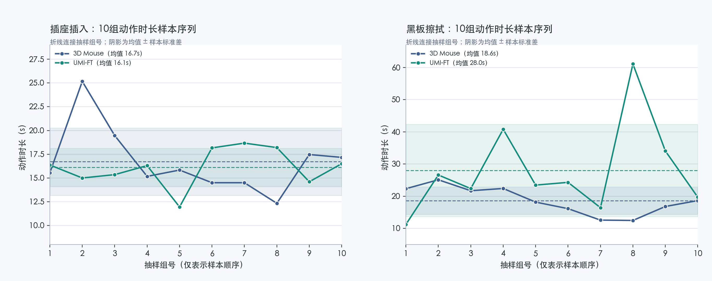
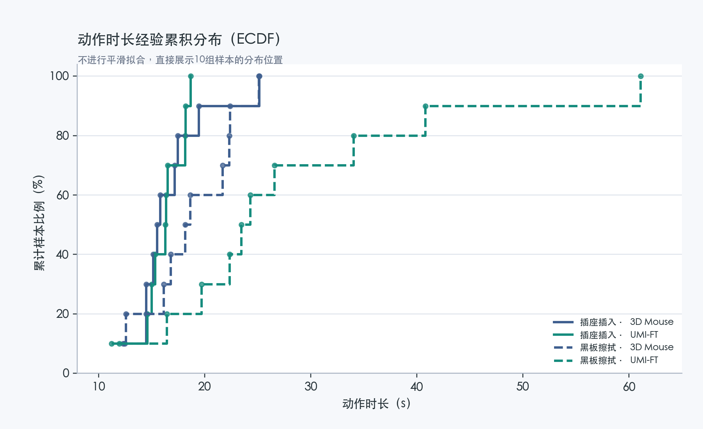
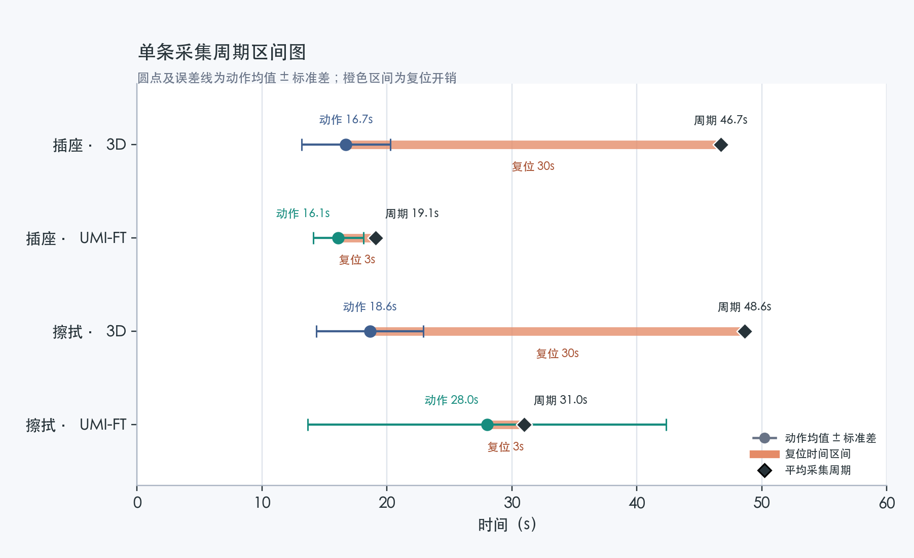
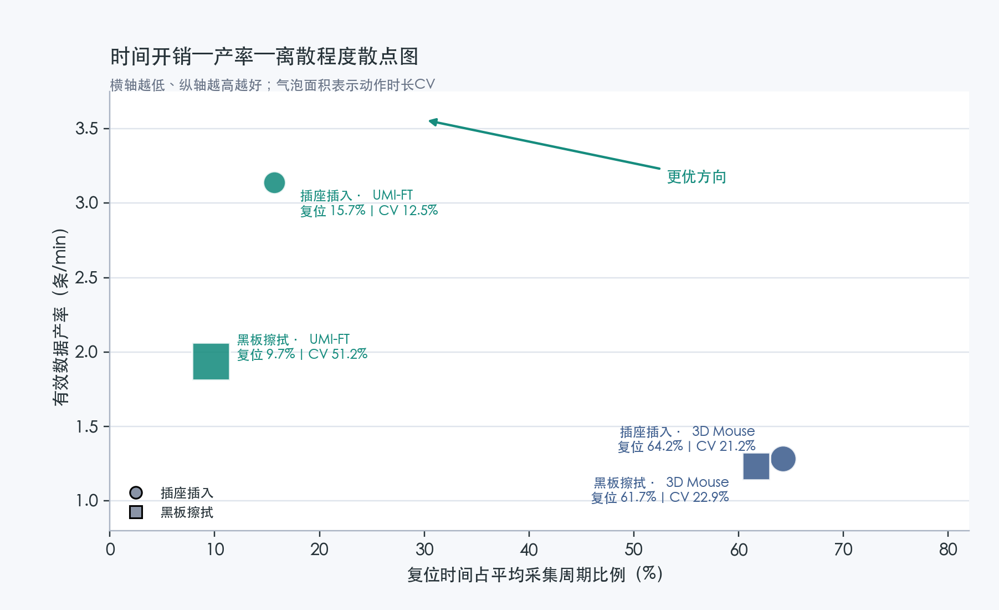
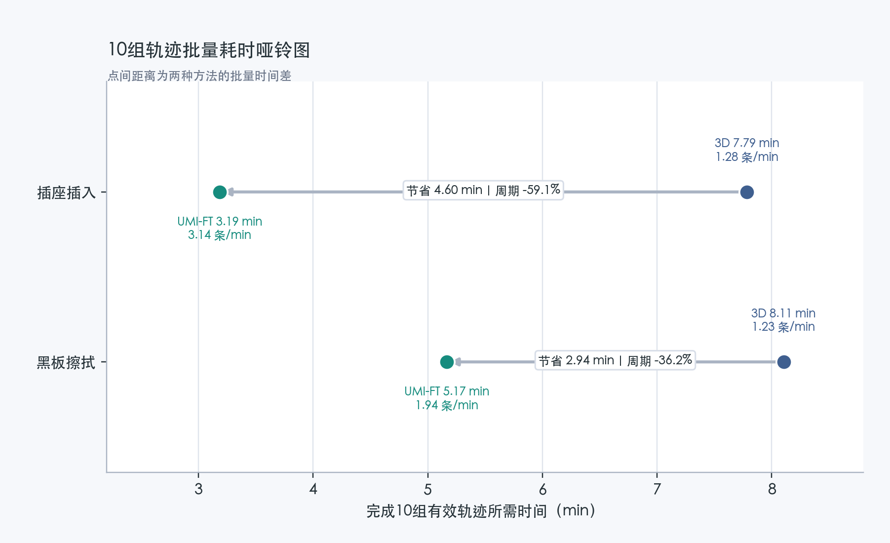
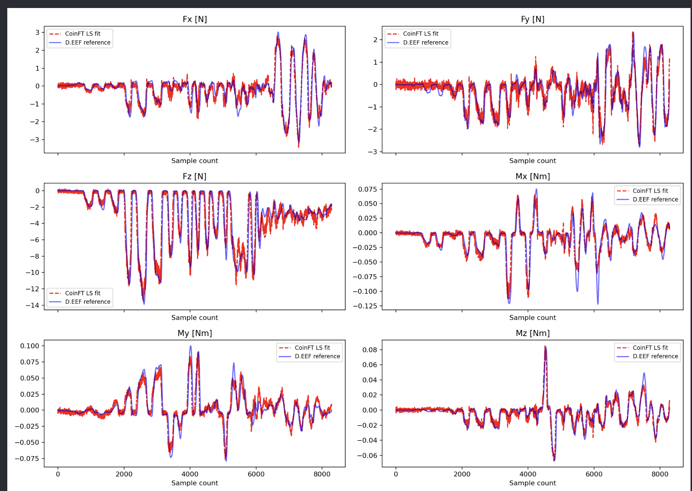

# 跨本体力控数据采集系统测试报告

本报告围绕跨本体力控数据采集系统的功能完整性、真实任务采集效果、多模态数据质量、CoinFT 力觉数据质量和采集效率开展测试。测试过程依据《力控数据采集设备基本操作说明》执行，统计结果由采集记录、时间对齐记录和结构化导出数据交叉核验。

真实任务测试选取插座插入和黑板擦拭两类数据，对 UMI-FT 与 3D Mouse 的有效动作时长、任务复位时间、单条采集周期和单位时间有效数据产率进行对比。3D Mouse 动作时长依据 `30 Hz` 采集频率和轨迹帧数换算；两种方法的任务复位时间均采用现场计时结果。

## 目录

1. [测试目的与范围](#1-测试目的与范围)
2. [测试依据、对象与数据源](#2-测试依据对象与数据源)
3. [测试方法与判定口径](#3-测试方法与判定口径)
4. [软件功能与完整采集流程验证](#4-软件功能与完整采集流程验证)
5. [真实任务数据采集测试](#5-真实任务数据采集测试)
6. [多模态数据质量](#6-多模态数据质量)
7. [数据质量控制](#7-数据质量控制)
8. [测试结论](#8-测试结论)

## 1. 测试目的与范围

本次测试包含以下内容：

1. 验证多设备数据接收、任务样本管理、时间同步和结构化数据导出的完整流程。
2. 验证系统对插座插入任务中精细对准、初始接触和插入过程的记录能力。
3. 验证系统对黑板擦拭任务中持续接触、往复运动和受力变化过程的记录能力。
4. 统计每条有效轨迹的动作时长、同步样本数和 CoinFT 原始力觉记录数。
5. 验证 CoinFT 的采样频率、连续性、接触响应和连接异常保护能力。
6. 对比 UMI-FT 与 3D Mouse 的单条采集周期、有效数据产率和采集效率。

## 2. 测试依据、对象与数据源

### 2.1 测试依据

- 《力控数据采集设备基本操作说明》：规定设备检查、校准、单条任务五阶段操作、力限制和无效轨迹判定。
- 《力控 UMI 数据采集调研与硬件选型设计方案》：规定 iPhone、D435/D435i、CoinFT/Teensy 和手持夹爪的系统组成。
- 《跨本体力控数据采集系统代码说明与测试报告》第 1～8 章：说明软件组成、时间对齐方法、数据分层和导出格式。

### 2.2 测试系统

<em>表 1　测试系统组成与采集频率</em>

| 组成        | 测试中的主要作用                                     |                                  采集频率 |
| ----------- | ---------------------------------------------------- | ----------------------------------------: |
| iPhone      | 第一视角 RGB、ARKit 六自由度位姿、夹爪开度和录制状态 |                                 `30 Hz` |
| D435/D435i  | 固定全局 RGB-D 和场景上下文                          |                                 `30 Hz` |
| 左右 CoinFT | 两路六维指端力/力矩                                  | `200 Hz`，验收下限 `100 Hz` |
| 笔记本端    | 设备状态检查、原始数据保存、时间对齐和结构化导出     |                        按单条任务组织数据 |

3D Mouse 对照系统由 3Dconnexion SpaceMouse、UFACTORY xArm6、双 RealSense RGB-D 相机和腕部六维力传感器组成。视觉与深度数据按 `30 Hz` 配置采集，机械臂完成一条任务后返回初始工作位并恢复场景，单条复位时间的现场计时结果为 `30 s`。

### 2.3 实测数据源

UMI-FT 数据源如下：

- 插座插入：`runs/run_20260716_184738_Insert_into_socket/`。
- 黑板擦拭：`runs/run_20260717_014520_Wipe_Blackboard/`。
- 数据归档：上述两项任务对应的原始采集记录和结构化导出数据。

每条轨迹的时间边界、样本数量和质量状态以系统生成的导出清单为准，并通过采集运行记录和时间同步日志进行复核。

3D Mouse 对照数据来自本项目同类任务的采集结果。插座插入数据批次包含 `100` 条轨迹和 `50107` 帧，黑板擦拭数据批次包含 `100` 条轨迹和 `56810` 帧。轨迹动作时长按 `30 Hz` 采集频率由帧数换算，机械臂任务复位时间的现场计时结果为 `30 s/条`。

第 5 章从 UMI-FT 和 3D Mouse 的两类任务数据中各抽取 `10` 组有效轨迹进行统计对比，抽样对象和统计规则见第 5.1 节。

## 3. 测试方法与判定口径

### 3.1 单条任务采集阶段

每条有效轨迹均按照《力控数据采集设备基本操作说明》第 4.2 节规定的五个阶段完成。有效动作时长以开始录制和停止录制时刻为边界；任务物体复位在停止录制后进行，并计入单条采集周期。

1. 动作前：夹爪与目标分离，目标和指端保持在画面内；开始录制后保留 1～2 s 自由空间数据。检查位姿连续性和 CoinFT 空载基线。
2. 接近：在自由空间自然移动并在接近目标时减速。检查目标可见性和轨迹连续性。
3. 建立接触：对准后低速接近，再逐步增加夹持力或外部接触力。检查视觉接触时刻与 CoinFT 响应是否对应。
4. 持续操作：使用完成任务所需的有效力执行插入或擦拭。检查视觉、位姿、夹爪和力觉是否连续。
5. 释放与退出：任务完成后稳定放置、卸载并退出接触，保留 1～2 s 退出数据后停止录制。检查力觉回落情况和有效动作边界的完整性。

停止录制后，操作者将手持设备放回桌面并恢复任务物体。该复位过程的现场计时结果为 `3 s/条`，计入单条采集周期，但不计入有效动作时长。

  

<em>图 1　手持设备从接近、建立接触到持续操作的过程。</em>

### 3.2 两项任务的阶段说明

<em>表 2　两项任务与采集阶段对应关系</em>

| 阶段     | 插座插入             | 黑板擦拭           |
| -------- | -------------------- | ------------------ |
| 动作前   | 插头与插孔分离       | 板擦与板面分离     |
| 接近     | 向插孔移动并调姿     | 低速接近字迹区域   |
| 建立接触 | 插头接触插孔边缘     | 板擦接触板面       |
| 持续操作 | 对准并逐步施力至到位 | 保持接触并往复擦拭 |
| 释放退出 | 稳定后释放并退出     | 卸载并离开板面     |

### 3.3 采集与数据处理流程

插座插入和黑板擦拭任务采用相同的采集与数据处理流程：

1. 操作者按第 3.1 节规定的五阶段完成插入或擦拭任务。
2. 确认各设备状态正常后开始录制，iPhone、D435 和左右 CoinFT 分别保存带有时间戳的原始数据。
3. 任务完成后停止录制，系统保存单条轨迹的起止时间和各模态采集记录。
4. 对位姿、设备时间和传感器记录进行格式统一，并保留各类数据的原始采样信息。
5. 将局部 RGB、全局 RGB-D、工具中心位姿、夹爪开度和 CoinFT 数据对齐至统一时间轴。
6. 按规定的数据结构完成导出，并对样本数量、数据缺失、时间匹配、力觉频率和任务阶段完整性进行复核。

原始视觉与深度数据按 `30 Hz` 配置采集，结构化数据采用 `20 Hz` 统一时间轴；CoinFT 高频数据按原始采样时间独立保存。抽样数量和统计结果分别见第 5 章和第 6 章。

### 3.4 指标定义

<em>表 3　测试指标定义与计算方法</em>

| 指标 | 定义与计算方法 |
| --- | --- |
| 有效动作时长 | 单条轨迹从开始录制到停止录制的对齐时间差 |
| 有效同步样本数 | 写入统一时间轴的有效样本数量 |
| CoinFT 原始力觉样本数 | 单条轨迹中按原始采样时间保存的双指力觉记录数量 |
| CoinFT 采样频率 | 系统固定采样频率，单位为 Hz |
| 平均动作时长 | 各有效轨迹动作时长之和 / 有效轨迹数 |
| 动作时长变异系数 | `动作时长样本标准差 / 平均动作时长 × 100%`，用于描述任务执行时长的相对离散程度 |
| 单条采集周期 | 有效动作时长 + 单条复位时间 |
| 平均采集周期 | 各有效轨迹采集周期之和 / 有效轨迹数 |
| 复位时间占比 | `单条复位时间 / 平均采集周期 × 100%`，用于量化单条周期中的采集辅助开销 |
| 有效动作时间占比 | `平均动作时长 / 平均采集周期 × 100%`，与复位时间占比之和为 `100%` |
| 有效数据产率 | `60 / 平均采集周期`，单位为条/min |
| 10组轨迹批量耗时 | `平均采集周期 × 10 / 60`，单位为 min |
| 每10组节省时间 | `3D Mouse 10组批量耗时 - UMI-FT 10组批量耗时` |
| 采集周期缩短率 | `(T_3DMouse - T_UMIFT) / T_3DMouse × 100%` |
| 有效数据产率增幅 | `(R_UMIFT - R_3DMouse) / R_3DMouse × 100%` |

有效动作时长反映可用于后续处理的数据窗口，平均采集周期同时包含有效动作和任务复位，用于比较两种采集方法完成等量有效数据所需的时间。

### 3.5 有效轨迹判定

一条轨迹计入本报告统计需同时满足：

1. 任务成功：插头稳定插入，或黑板目标字迹被清除。
2. 五阶段完整：自由空间、接近、初始接触、持续操作和退出均有记录。
3. 各模态原始数据可完成格式统一、时间对齐和结构化导出。
4. 数据缺失、时间匹配和帧复用等质量指标记录完整；指标超出设定范围时，具有相应的人工复核结果和判定依据。

## 4. 软件功能与完整采集流程验证

### 4.1 软件功能验证

软件功能测试于 2026-08-06 完成，采用自动化回归测试验证采集系统核心功能的正确性和稳定性。

<em>表 4　软件功能测试结果</em>

| 测试对象 | 主要测试内容 | 测试用例数 | 通过数 | 测试结果 |
| --- | --- | ---: | ---: | --- |
| 采集与数据处理软件 | 设备数据接收与解析、多设备时间同步、任务样本管理、异常恢复、CoinFT 标定数据处理、多模态时间对齐和结构化数据导出 | 100 | 100 | 通过 |

共执行 `100` 项测试，全部通过。设备数据处理、时间同步、异常恢复和数据导出等受测功能均达到预期结果。

### 4.2 真实设备采集闭环验证

插座插入和黑板擦拭任务均完成从采集准备到质量复核的真实设备测试。各环节验证结果如下。

<em>表 5　真实设备采集闭环验证结果</em>

| 验证环节 | 验证内容 | 结果 |
| --- | --- | --- |
| 采集准备 | 检查 iPhone、D435 和左右 CoinFT 的连接及数据状态 | 通过 |
| 原始数据记录 | 保存局部 RGB、全局 RGB-D、工具中心位姿、夹爪开度和左右 CoinFT 力觉数据 | 通过 |
| 时间对齐 | 将各模态数据匹配至统一时间轴，并保留 CoinFT 原始采样记录 | 通过 |
| 结构化导出 | 按单条轨迹组织并导出多模态数据 | 通过 |
| 质量复核 | 检查数据缺失、时间匹配、力觉频率和任务阶段完整性 | 通过 |

两项任务的结构化轨迹数据均保留采集时间和轨迹归属信息，可用于后续复核与处理。

  

<em>图 2　单条轨迹中的 RGB、深度、位姿和力觉数据。</em>

## 5. 真实任务数据采集测试

本节比较 UMI-FT 与 3D Mouse 两种采集方案在插座插入和黑板擦拭任务中的采集效率。两种方案在每类任务中各抽取 `10` 组有效轨迹，比较动作时长及其离散程度、任务复位开销、平均采集周期、批量采集耗时和单位时间有效数据产率。合同规定的采集效率指标采用采集周期缩短率计算，公式为 `(T_3DMouse - T_UMIFT) / T_3DMouse × 100%`。

### 5.1 抽样与计时口径

3D Mouse 的插座插入和黑板擦拭数据源各包含 `100` 条轨迹。本报告按轨迹序号等间隔抽取第 `1、12、23、34、45、56、67、78、89、100` 条，共 `10` 组；每条轨迹的动作时长依据帧数计算。UMI-FT 从两类任务数据中分别抽取 `10` 组满足任务完成和多模态完整性要求的有效轨迹。

3D Mouse 动作时长依据轨迹帧数和 `30 Hz` 采集频率换算，UMI-FT 动作时长依据对齐后的起止时间计算。两种方法均按“有效动作时长 + 任务复位时间”计算单条采集周期。复位时间采用现场计时结果，3D Mouse 为 `30 s/条`，UMI-FT 为 `3 s/条`。离散程度采用样本标准差表示；合同规定的采集效率指标按采集周期缩短率计算，即 `(T_3DMouse - T_UMIFT) / T_3DMouse × 100%`。

### 5.2 抽样统计结果

<em>表 6　UMI-FT 与 3D Mouse 采集效率统计结果</em>

| 任务 | 方法 | 动作时长均值 ± 标准差（s） | 动作时长变异系数 | 复位时间/周期占比（s / %） | 平均采集周期（s） | 10组批量耗时（min） | 有效数据产率（条/min） | 采集周期缩短率 |
| --- | --- | ---: | ---: | ---: | ---: | ---: | ---: | ---: |
| 插座插入 | 3D Mouse | 16.713 ± 3.549 | 21.2% | 30 / 64.2% | 46.713 | 7.786 | 1.284 | 基准 |
| 插座插入 | UMI-FT | 16.111 ± 2.022 | 12.6% | 3 / 15.7% | 19.111 | 3.185 | 3.140 | 59.1% |
| 黑板擦拭 | 3D Mouse | 18.630 ± 4.266 | 22.9% | 30 / 61.7% | 48.630 | 8.105 | 1.234 | 基准 |
| 黑板擦拭 | UMI-FT | 28.006 ± 14.330 | 51.2% | 3 / 9.7% | 31.006 | 5.168 | 1.935 | 36.2% |

插座插入任务中，两种方法的平均动作时长接近；UMI-FT 的动作时长变异系数由 `21.2%` 降至 `12.6%`，复位时间占比由 `64.2%` 降至 `15.7%`。完成 `10` 组有效轨迹的预计总时间由 `7.786 min` 降至 `3.185 min`，节省 `4.600 min`。

黑板擦拭任务中，UMI-FT 根据字迹范围和接触状态调整擦拭过程，动作时长均值及变异系数高于 3D Mouse；复位时间占比仍由 `61.7%` 降至 `9.7%`。完成 `10` 组有效轨迹的预计总时间由 `8.105 min` 降至 `5.168 min`，节省 `2.937 min`。动作时长变异系数反映任务执行时长的离散程度，黑板擦拭中的较高数值主要对应不同轨迹擦拭范围和持续时间的差异。

  

<em>图 3　插座插入与黑板擦拭任务中两种方法的 10 组动作时长样本序列，虚线为均值，阴影为均值 ± 样本标准差。</em>

  

<em>图 4　四组样本的动作时长经验累积分布（ECDF），不作平滑拟合，直接反映 10 组样本的分布位置。</em>

复位时间属于任务间设备回位和场景恢复所需的采集辅助开销。复位时间占比越低，表示单条采集周期中用于记录有效动作的时间比例越高；该指标用于分析时间利用结构，不用于评价单条轨迹的数据质量。

  

<em>图 5　单条采集周期区间图：圆点及误差线为动作时长均值 ± 标准差，橙色区间为复位开销，菱形为平均采集周期。</em>

  

<em>图 6　复位时间占比、有效数据产率与动作时长离散程度的关系，气泡面积表示动作时长变异系数。</em>

  

<em>图 7　完成 10 组有效轨迹的批量耗时对比，点间距离为两种方法的批量时间差。</em>

### 5.3 对比结论

按照合同规定的采集周期缩短率计算，UMI-FT 在插座插入和黑板擦拭任务中的结果分别为 `59.1%` 和 `36.2%`，均高于 `10%` 的目标值。对应的单位时间有效数据产率分别由 `1.284 条/min` 提高至 `3.140 条/min`、由 `1.234 条/min` 提高至 `1.935 条/min`，增幅分别为 `144.4%` 和 `56.8%`。结果表明，UMI-FT 在不占用真实机器人的情况下，可减少任务间的复位和系统重新准备时间，从而提高单位时间内获得的有效轨迹数量。

## 6. 多模态数据质量

本次抽取的 `20` 组 UMI-FT 有效轨迹同时接受视觉、深度、位姿、夹爪状态和 CoinFT 力觉质量检查。统计结果如下。

<em>表 7　多模态数据质量统计结果</em>

| 任务   | 有效轨迹数 | 有效同步样本数 | CoinFT 原始力觉样本数 | CoinFT 采样频率 | 必需视觉数据缺失数 |
| ------ | -----------: | -----: | ------------: | -----------: | ---------------: |
| 插座插入 |           10 |   3145 |         29070 |       200 Hz |                0 |
| 黑板擦拭 |           10 |   5580 |         54134 |       200 Hz |                0 |
| 合计   |           20 |   8725 |         83204 |       200 Hz |                0 |

CoinFT 采样频率为 `200 Hz`，高于 `100 Hz` 验收下限；局部 RGB、全局 RGB 和全局深度图三项必需视觉数据完整。黑板擦拭数据中的可选 iPhone 深度图缺失 `2` 帧，占该任务有效同步样本数的 `0.036%`。质量记录同时保存帧复用比例、时间匹配误差和人工复核结果。

CoinFT 的感知元件直接测量多通道电容变化，六轴力/力矩由标定后的多层感知机（MLP）模型估计。该模型学习电容响应与参考六维力/力矩之间的非线性映射，因此 CoinFT 输出本质上是基于标定数据的力值估计，而不是由单一传感通道直接换算得到的绝对力值。模型参数由成对的电容数据和参考力标签确定，输出准确性取决于标定数据质量及模型拟合效果。

CoinFT 分别安装在夹爪左右指端，能够在夹持物体和接触外部环境时记录两侧受力。下图左侧给出指端安装结构，右侧给出内部夹持力和外部接触力作用下的响应，用于检查传感器安装位置与力觉变化之间的物理对应关系。

<table>
  <tr>
    <td width="100%" align="center">演示图位于未随源码包交付的 <code>show/</code> 资料中。</td>
  </tr>
</table>

<em>图 8　CoinFT 指端安装结构及外部接触力、内部夹持力响应。</em>

下图中红色虚线为 CoinFT 模型拟合输出，蓝色实线为参考六维力/力矩传感器输出。六个轴在正负方向、峰值位置、变化相位和整体趋势上保持较高一致性。该结果表明，CoinFT 的模型估计能够较准确地跟随参考传感器输出；对于本项目关注的接触建立、受力方向、相对载荷变化和动态过程记录，其拟合效果满足插座插入与黑板擦拭任务的数据采集要求。

  

<em>图 9　CoinFT 六轴模型拟合质量：红色虚线为模型输出，蓝色实线为参考六维力/力矩传感器输出。</em>

动作前和接近阶段提供空载力觉基线，建立接触阶段出现力觉变化，持续操作阶段同时包含工具中心运动和连续接触力，释放与退出阶段力觉回落。图像、位姿、夹爪宽度和工具中心力沿同一时间轴回放，可用于检查第 3.1 节所述五个阶段在时间和物理过程上的一致性。

  

<em>图 10　单条轨迹中图像、位姿、夹爪和力觉的时间对齐结果。</em>

## 7. 数据质量控制

系统在采集前、采集过程中和采集后实施质量控制，并结合人工复核确定轨迹是否有效：

1. 采集前检查 D435、CoinFT 等设备的连接状态和数据更新时间。设备未正常运行或数据长时间未更新时，不允许开始正式采集。
2. 正式采集前如检测到 CoinFT 连接中断，即使视觉数据仍可获取，也不允许开始该条轨迹的采集。
3. 采集完成后，自动统计目标帧复用、数据缺失和时间匹配情况，并保存相应质量指标。
4. 有效轨迹需同时满足任务完成、操作过程合理、画面质量合格和必需数据完整等条件。
5. 质量指标超出设定范围时，由人工结合任务过程进行复核，并记录复核结果和判定依据。

  

<em>图 11　电脑端轨迹对齐和质量检查界面。</em>

## 8. 测试结论

本报告完成了软件功能、完整采集流程、真实任务、多模态完整性、力觉质量和采集效率测试，重点验证系统的完整运行能力、真实任务数据质量和合同指标符合情况。测试结论如下：

1. 系统完成了从设备状态检查、多模态原始数据记录、时间对齐到结构化数据导出和质量复核的完整流程验证；软件功能测试共执行 `100` 项，全部通过。
2. 本次从插座插入和黑板擦拭数据中共抽取 `20` 组 UMI-FT 有效轨迹，对应 `8725` 个有效同步样本和 `83204` 条双指 CoinFT 原始力觉记录。
3. 局部 RGB、全局 RGB 和全局深度图的缺失数均为 `0`；可选 iPhone 深度图缺失 `2` 帧，占黑板擦拭任务有效同步样本数的 `0.036%`。
4. CoinFT 采样频率为 `200 Hz`，高于 `100 Hz` 验收下限，并能够记录动作前、接触建立、持续操作和释放退出阶段的力觉变化。
5. 插座插入任务中，3D Mouse 与 UMI-FT 各抽取 `10` 组有效轨迹，平均单条采集周期分别为 `46.713 s` 和 `19.111 s`，采集周期缩短率为 `59.1%`，有效数据产率提高 `144.4%`。
6. 黑板擦拭任务中，3D Mouse 与 UMI-FT 各抽取 `10` 组有效轨迹，平均单条采集周期分别为 `48.630 s` 和 `31.006 s`，采集周期缩短率为 `36.2%`，有效数据产率提高 `56.8%`。
7. UMI-FT 在两项任务中的采集周期缩短率均超过 `10%`，同时满足多模态完整性、高频力觉记录和质量判定结果可追溯要求。
