# UMIFT 数据采集操作指南

> 本指南面向首次使用者，覆盖 Mac 首次部署、每次启动、设备校准、Episode 录制和 Dataset 切换。

截图标记规则：红框和红色编号表示需要点击或输入的操作，黄色框表示只需要观察确认的状态。

## 0. 首次部署（每台 Mac 和 iPhone 只做一次）

如果这台 Mac 已经能打开 `http://127.0.0.1:8767/`，iPhone 上也已经安装 `UMIFTiPhoneCaptureCore`，直接跳到第 1 节。

本指南使用的项目根目录是：

```text
/Users/550m/code/UMIFT-datacollect
```

如果项目被放在其他位置，下面所有命令中的这一前缀都要一起替换。不要只复制项目的某个子目录，D435 运行时还会使用 `modules/01_global_camera/` 中的 librealsense 运行库。

### 0.1 需要准备的软硬件

- macOS 电脑，并安装完整 Xcode。当前已验证的 Xcode 位置是 `/Users/550m/Downloads/Xcode.app`。
- iOS 17.0 或更高版本的 iPhone，开启开发者模式，通过 USB 连接、解锁并信任这台 Mac。
- Intel RealSense D435/D435i。
- 已刷写 CoinFT bridge 固件的 Teensy 和两路 CoinFT。
- 已配置的 Python 3.9 Conda 环境。当前已验证的解释器是 `/Users/550m/miniforge3/envs/umift_datacollection/bin/python`。

> 当前仓库还没有提交 `environment.yml` 或 `requirements.txt`。因此，对一台全新 Mac，Python 环境还不是可从仓库一键重建的部署项。本机正式采集应使用上面已验证的解释器，不要临时换成系统 `python3`。

### 0.2 项目文件层级

日常部署和采集只需要认识下面这些目录：

```text
UMIFT-datacollect/
├── modules/
│   ├── 01_global_camera/
│   │   ├── install_realsense_macos.sh       # 构建 D435 运行库
│   │   └── third_party/librealsense-install/ # 构建后的 D435 运行库
│   ├── 02_iphone_gripper/
│   │   ├── 02_apple_capture_flow/           # iPhone 采集设计文档
│   │   └── ios_app/UMIFTiPhoneCaptureCore/  # 正式 iPhone App 工程
│   │       ├── App/                         # Swift 源码
│   │       └── UMIFTiPhoneCaptureCore.xcodeproj
│   └── 04_laptop_alignment_export/
│       ├── entrypoints/                         # 用户可直接运行的命令入口
│       ├── umift_laptop_alignment/
│       │   ├── capture/                    # iPhone / D435 / CoinFT 三路接收
│       │   ├── orchestration/              # Dataset、Episode 和录制状态
│       │   └── pipeline/                   # normalize / align / export
│       ├── config/                              # 导出配置
│       └── docs/                                # 操作和开发文档
└── runs/                                             # 真实采集数据
```

浏览器中的一个 Dataset，对应 `runs/` 下的一个 `run_*` 目录。其内部层级是：

```text
runs/run_<time>_<task>/
├── RUN_MANIFEST.json   # Dataset/Episode 元数据和处理状态
├── raw/                # 三路原始数据，不要手工修改
│   ├── iphone_stream/
│   ├── global_camera/
│   └── coinft/
├── normalized/         # Episode 归一化中间结果
├── aligned/            # 时间对齐中间结果
├── exports/            # 最终 UMI-FT Zarr
└── logs/               # 同步和运行日志
```

不要用 Finder 改名、合并或删除某个 Dataset 中的单独 Episode。这会破坏 `RUN_MANIFEST.json` 中的索引和导出映射。

### 0.3 检查项目和 Python 环境

打开 Mac 的“终端”，执行：

```bash
cd /Users/550m/code/UMIFT-datacollect

test -f modules/04_laptop_alignment_export/entrypoints/receiver_web_gui.py \
  && echo "project files: ok"

/Users/550m/miniforge3/envs/umift_datacollection/bin/python --version

/Users/550m/miniforge3/envs/umift_datacollection/bin/python -c \
  'import av, cv2, numpy, serial, zarr; print("python dependencies: ok")'
```

正常情况下应看到 `project files: ok`、`Python 3.9.x` 和 `python dependencies: ok`。如果任何一条失败，不要继续录制；先修复项目路径或 Conda 环境。

### 0.4 安装 D435 运行库和一次性授权

先检查 librealsense 运行库是否已经存在：

```bash
cd /Users/550m/code/UMIFT-datacollect

test -d modules/01_global_camera/third_party/librealsense-install \
  && echo "librealsense runtime: ok"
```

如果没有输出 `librealsense runtime: ok`，需要联网构建一次：

```bash
cd /Users/550m/code/UMIFT-datacollect
bash modules/01_global_camera/install_realsense_macos.sh
```

该脚本需要 `git`、`cmake` 和 Xcode Command Line Tools，并会构建 librealsense。完成后安装 D435 固定控制入口和最小化 sudoers 规则：

```bash
cd /Users/550m/code/UMIFT-datacollect
bash modules/04_laptop_alignment_export/entrypoints/install_sudoers_macos.sh
```

这一步会要求输入一次 macOS 密码，并安装：

```text
/usr/local/libexec/umift-laptop-alignment-d435/
/private/etc/sudoers.d/umift_laptop_alignment_d435
```

它只允许主程序无密码调用固定的 D435 控制入口，不是通用免密 sudo。用下面的命令验证相机：

```bash
cd /Users/550m/code/UMIFT-datacollect
bash modules/04_laptop_alignment_export/umift_laptop_alignment/capture/receivers/d435/run_d435_macos.sh list
```

如果 D435 控制脚本或 librealsense 运行库后续升级，重新执行本节的 sudoers 安装命令。

### 0.5 检查 CoinFT / Teensy

接入 Teensy 后执行：

```bash
/bin/bash -c 'for port in /dev/cu.usbmodem*; do
  [[ -e "$port" ]] && printf "%s\n" "$port"
done'
```

应至少看到一个 `/dev/cu.usbmodem...` 串口。可能在重插、换接口或换设备后改变；主程序默认会自动检测，不要把旧尾号当成永久配置。

### 0.6 首次编译并安装 iPhone App（仅维护人员）

如果 iPhone 上已经有 `UMIFTiPhoneCaptureCore`，不需执行本节。

先连接、解锁和信任 iPhone，然后查询 `xcodebuild` 可使用的设备 UDID：

```bash
cd /Users/550m/code/UMIFT-datacollect/modules/02_iphone_gripper/ios_app/UMIFTiPhoneCaptureCore

DEVELOPER_DIR=/Users/550m/Downloads/Xcode.app/Contents/Developer \
  xcodebuild \
  -project UMIFTiPhoneCaptureCore.xcodeproj \
  -scheme UMIFTiPhoneCaptureCore \
  -showdestinations
```

在 `Available destinations` 中找到目标实体 iPhone，把它的 `id` 填到下面的 `<DEVICE_UDID>`。不要选择 `Any iOS Device` 或 iOS Simulator：

```bash
cd /Users/550m/code/UMIFT-datacollect/modules/02_iphone_gripper/ios_app/UMIFTiPhoneCaptureCore

export DEVELOPER_DIR=/Users/550m/Downloads/Xcode.app/Contents/Developer
export DEVICE_UDID="<DEVICE_UDID>"

xcodebuild \
  -project UMIFTiPhoneCaptureCore.xcodeproj \
  -scheme UMIFTiPhoneCaptureCore \
  -configuration Debug \
  -destination "id=${DEVICE_UDID}" \
  -derivedDataPath .deriveddata \
  -allowProvisioningUpdates \
  build

xcrun devicectl device install app \
  --device "${DEVICE_UDID}" \
  .deriveddata/Build/Products/Debug-iphoneos/UMIFTiPhoneCaptureCore.app

xcrun devicectl device process launch \
  --device "${DEVICE_UDID}" \
  --terminate-existing \
  com.local.umift.capturecore
```

如果 Xcode 安装在 `/Applications/Xcode.app`，将上面的 `DEVELOPER_DIR` 改为 `/Applications/Xcode.app/Contents/Developer`。如果报签名错误，需要在 Xcode 中打开 `UMIFTiPhoneCaptureCore.xcodeproj`，为 target 选择当前开发者账号的 Team，再重新执行命令。

第一次打开 App 时：

1. 允许相机权限。
2. 允许本地网络权限。
3. 保持 iPhone 解锁，确认 App 能进入横屏采集页。

### 0.7 首次部署完成标准

以下条件全部满足，才算完成部署：

- Python 检查输出 `python dependencies: ok`。
- D435 `list` 命令能看到 RealSense 设备。
- Teensy 检查命令能输出 `/dev/cu.usbmodem...` 串口。
- `devicectl list devices` 能看到已配对 iPhone。
- iPhone 上已安装 App，并已授予相机和本地网络权限。
- 按第 3 节启动服务后，浏览器能打开 `http://127.0.0.1:8767/`。

## 1. 先理解三个控制位置

整个系统有三个不同层面的控制，不能混用：

| 位置       | 负责什么                                 | 正常操作                                                   |
| ---------- | ---------------------------------------- | ---------------------------------------------------------- |
| Mac 终端   | 启动网页服务                             | 每次开机后运行一次启动命令                                 |
| Mac 浏览器 | 选择 Dataset、启动三路设备、查看状态     | `New Dataset`、`Resume Dataset`、`Arm All`、`Stop` |
| iPhone App | 校准、开始一条 Episode、结束一条 Episode | `开始校准`、`标记原点`、圆形录制按钮、红色停止按钮     |

最重要的区别：

- 浏览器的 `Arm All`：启动并连接 iPhone、D435、CoinFT，使设备进入待录制状态。
- iPhone 右下角的圆形录制按钮：真正开始一条正式录制 Episode。
- 录制中右下角的红色停止按钮：正常结束当前 Episode。
- 浏览器的 `Stop`：关闭整套采集设备，主要用于切换 Dataset、结束当天采集或故障重启。不要用它代替 iPhone `Terminate`。

## 2. 开始前的硬件检查

1. D435 已连接 Mac。
2. CoinFT/Teensy 已连接 Mac。
3. iPhone 已通过 USB 连接 Mac，手机已解锁，并已信任这台电脑。
4. iPhone 上已经安装 `UMIFTiPhoneCaptureCore`。
5. 已经按第 0 节完成这台 Mac 的 D435 运行库和 sudoers 安装。

## 3. 每次启动服务

打开 Mac 的“终端”，运行：

```bash
cd /Users/550m/code/UMIFT-datacollect/modules/04_laptop_alignment_export

/Users/550m/miniforge3/envs/umift_datacollection/bin/python \
  entrypoints/receiver_web_gui.py \
  --host 127.0.0.1 \
  --port 8767 \
  --no-open \
  --no-auto-start
```

看到以下文字表示网页服务已经启动：

```text
receiver web GUI: http://127.0.0.1:8767/
```

终端窗口需要保持打开。不要在采集过程中关闭窗口或按 `Control+C`。

然后在浏览器打开：

```text
http://127.0.0.1:8767/
```

建议使用 `--no-auto-start`，这样用户可以先选择正确的 Dataset，再启动设备，避免数据写入上一次任务。

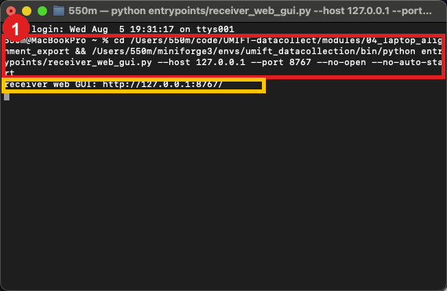

图 T-01：红框 1 是启动命令；黄色框中的 `receiver web GUI: http://127.0.0.1:8767/` 表示服务启动成功。

## 4. 新建一个录制任务

每一种任务、场景或实验条件应使用独立 Dataset。

1. 在浏览器点击 `New Dataset`。
2. 在弹窗填写：
   - `Dataset name`：数据集名称，例如 `PickUp_Cup_20260805`。
   - `Task name`：任务名称，例如 `Pick Up Cup`。
   - `Notes`：场景、被操作物体、实验条件等备注。
3. 点击 `Create Dataset`。
4. 确认页面顶部 Dataset 下拉框显示刚创建的名称。

命名建议：

```text
动作_物体_日期_条件
```

例如：

```text
PickUp_Cup_20260805_Normal
Insert_Plug_20260805_LeftHand
```

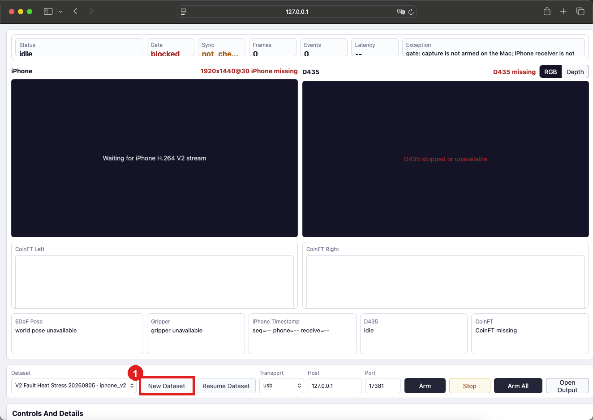

图 B-01：点击红框 1 中的 `New Dataset`。

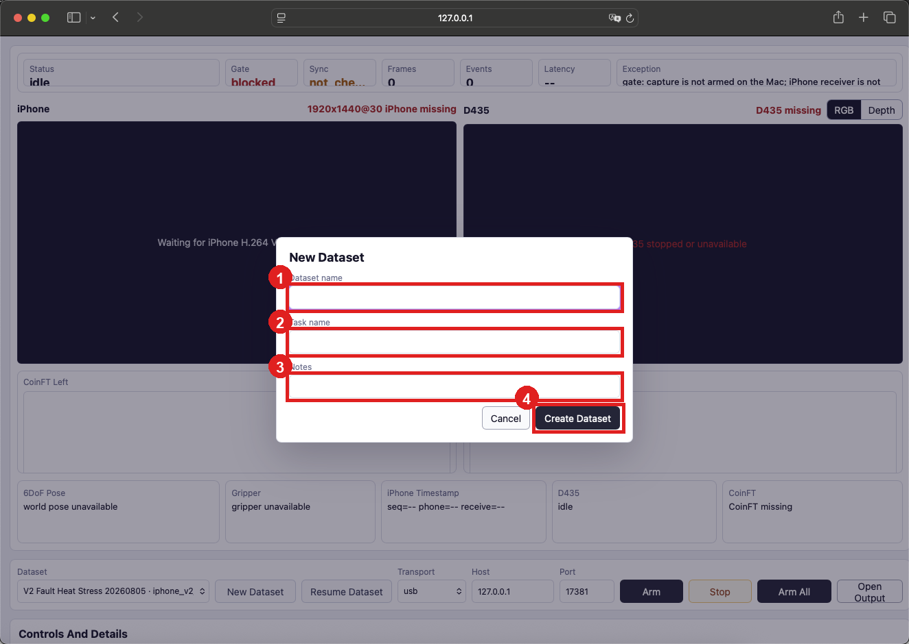

图 B-02：依次填写 1 `Dataset name`、2 `Task name`、3 `Notes`，最后点击 4 `Create Dataset`。

## 5. 继续已有任务

如果 Dataset 已经存在：

1. 在 `Dataset` 下拉框选择目标 Dataset。
2. 点击 `Resume Dataset`。
3. 确认下拉框保持为目标 Dataset。

如果按钮无法点击，通常是因为设备仍在运行。先点击浏览器 `Stop`，等待页面状态停止，再重新选择 Dataset。

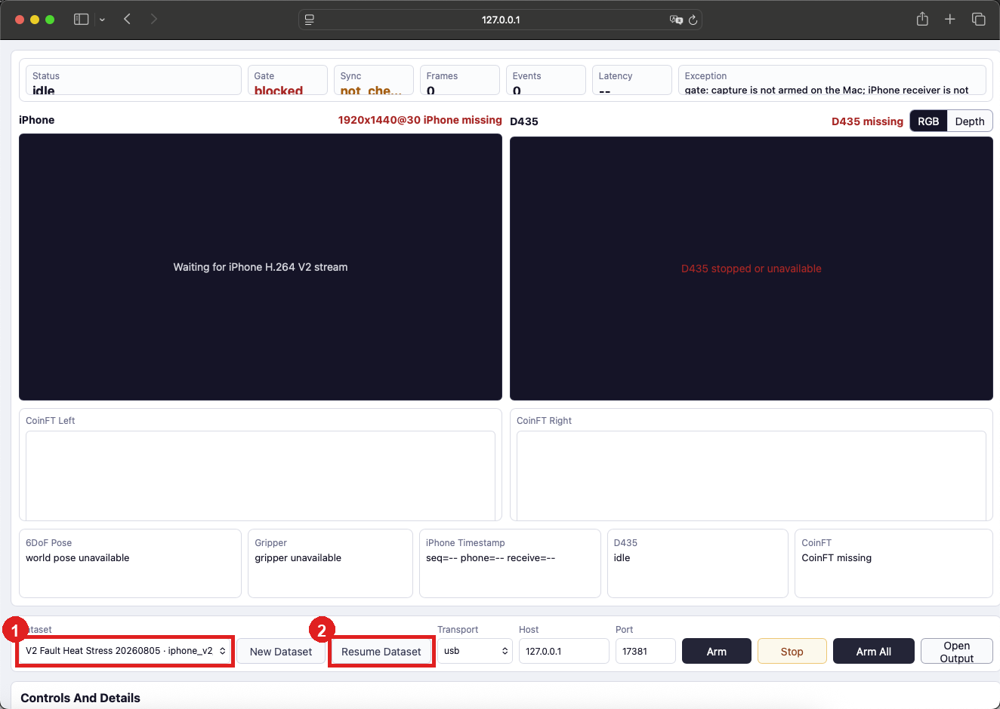

图 B-03：先在红框 1 选择 Dataset，再点击红框 2 `Resume Dataset`。

## 6. 点击 Arm All 点亮三路设备

确认 Dataset 正确后：

1. 保持 `Transport` 为 `usb`。
2. 保持 `Port` 为 `17381`。
3. `Pre-roll seconds` 应为 `1.5`。
4. 点击 `Arm All`。
5. 从点击按钮开始保持夹爪完全空载，不要触碰两个 CoinFT 指尖。
6. 等待 iPhone、D435、CoinFT 都进入正常状态。

CoinFT 启动不会立即判定为 ready。Mac 会先做 raw 稳定门控和第一次临时去皮，再让完整运行负载稳定 5 秒，执行第二次最终 raw 去皮，随后用约 1 秒空载模型输出建立固定 `ft_bias`。最后 1 秒空载检查中，两侧各力轴的最大零点均值必须不超过 `0.15 N`；全部通过后 `CoinFT Calibration` 才显示 `ready`，录制 Gate 才会开放。

即使 CoinFT 已经由调试按钮单独启动，点击 `Arm` 或 `Arm All` 也会重新启动 CoinFT 并重新执行上述校准，确保 iPhone、D435 和 GUI 的正式运行负载在最终去皮之前已经参与。

若显示 `zero_check_failed` 或零点超过 `0.15 N`，先确认夹爪空载，再点击 `Stop CoinFT` 和 `Start / Re-zero CoinFT`，或点击页面顶部 `Stop` 后重新 `Arm All`。程序不会在未知受力时自动重新去皮。

正常页面应满足：

- iPhone 区域出现实时画面，不再显示 `Waiting for iPhone H.264 V2 stream`。
- D435 区域出现 RGB 或 Depth 画面。
- CoinFT Left 和 CoinFT Right 曲线持续更新。
- 顶部 `Status` 显示 connected/ready 类状态。
- 顶部 `Gate` 最终应为 ready；如果手机尚未完成世界坐标校准，Gate 暂时 blocked 是正常的。
- `Alignment` 显示 `bidirectional_affine_low_rtt` 或 receiver aligned。

`Arm` 与 `Arm All` 的区别：普通用户统一使用 `Arm All`。单独的 `Arm`、`Start D435 Preview` 和 `Start / Re-zero CoinFT` 主要用于调试某一路设备。

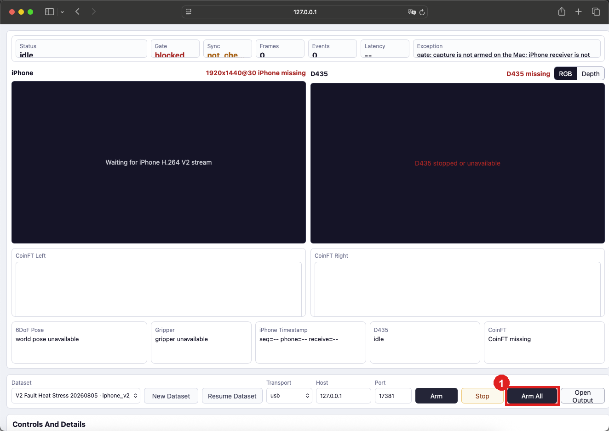

图 B-04：确认 Dataset 后，点击红框 1 `Arm All`。

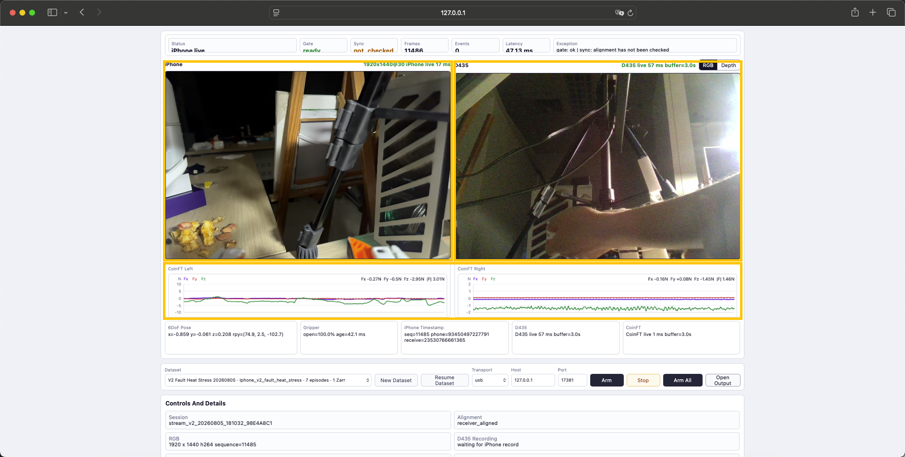

图 B-05：三个黄色区域分别是 iPhone `1920x1440@30` 实时画面、D435 实时画面，以及 CoinFT Left/Right 实时曲线。画面和曲线都应持续变化，底部 D435/CoinFT 状态应显示 `live`。

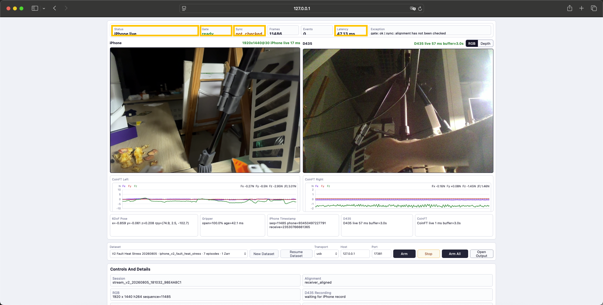

图 B-06：黄色框从左到右标出 `Status`、`Gate`、`Sync` 和 `Latency`。本图是真实设备在线状态：`Status` 为 `iPhone live`、`Gate` 为 `ready`。`Sync` 显示 `not checked` 时仍需查看下方 `Alignment`；正式录制前应确认它已经是 `receiver_aligned` 或 `bidirectional_affine_low_rtt`。

## 7. 打开 iPhone App 并完成校准

打开 iPhone 上的 `UMIFTiPhoneCaptureCore`。App 默认横屏使用。

### 7.1 开始夹爪校准

1. 点击画面底部的 `开始校准`。
2. App 进入 `Gripper Cal`，预览切换到 `Ultra`。
3. 保证夹爪两侧 marker 都能清楚出现在画面中。
4. 缓慢做至少 3 次完整开合：完全打开、完全闭合、再打开。
5. 页面状态会显示类似 `开合 x.x/3`。
6. 样本足够后 App 通常会自动进入下一阶段；如果按钮显示 `保存夹爪`，点击它完成夹爪路径校准。

校准时不要快速抖动夹爪，也不要让 marker 长时间离开画面。

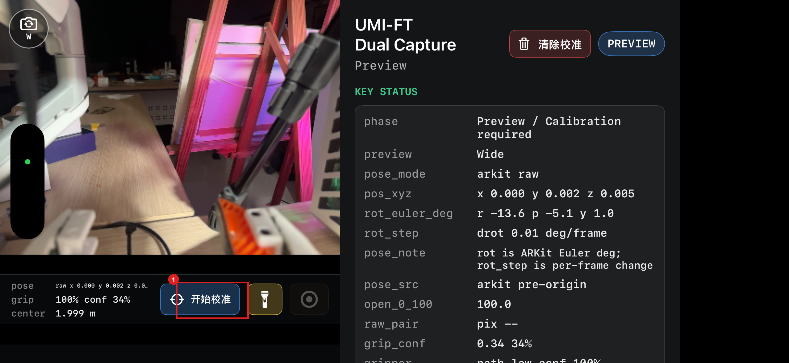

图 I-01：点击红框 1 中的 `开始校准`。顶部状态为 `PREVIEW`，右侧 `phase` 显示 `Preview / Calibration required`。

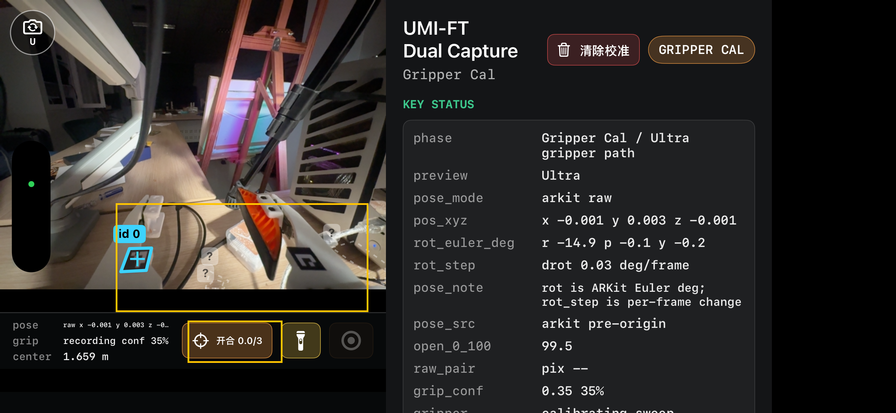

图 I-02：黄色区域标出 marker 识别范围和 `开合 x.x/3` 进度。夹爪完整开合至少 3 次，预览应保持为 `Ultra`。

### 7.2 标定世界坐标原点

夹爪校准完成后，App 进入 `World Cal`，预览切换到 `Wide`。

1. 将手机摄像头对准工作台上的平整区域。
2. 让画面中心十字对准希望作为世界原点的位置。
3. 等待 AR tracking 稳定，并确认中心可以命中平面。
4. 点击 `标记原点`。
5. 画面出现坐标轴后保持手机和场景稳定。
6. 等待约 10 秒，App 自动进入 `Ready`。

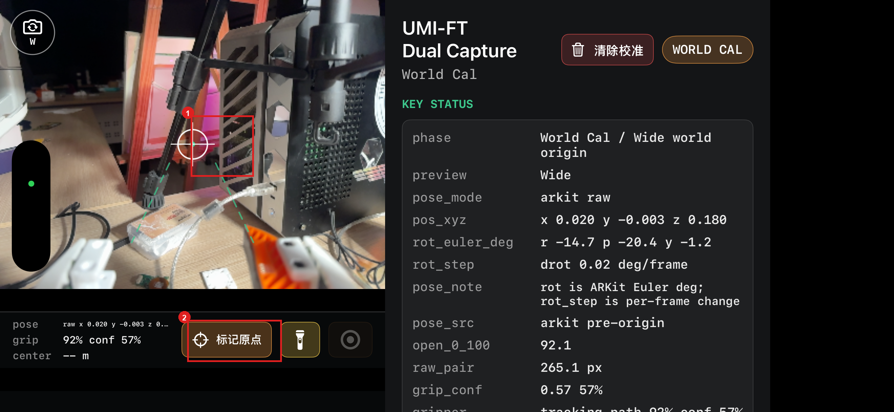

图 I-03：先让红框 1 中的中心十字命中目标平面，再点击红框 2 `标记原点`。

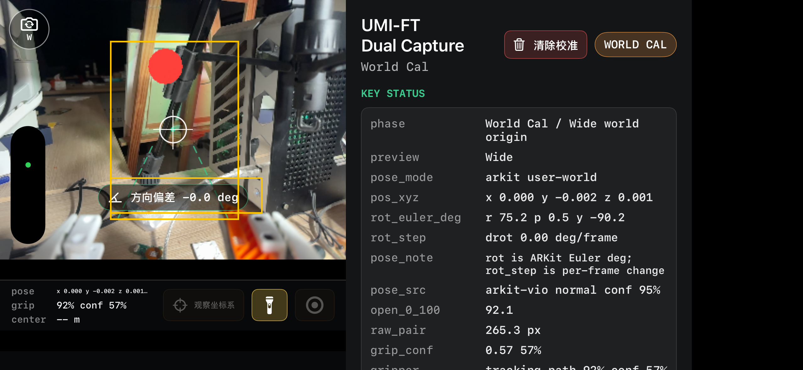

图 I-04：黄色区域标出世界坐标确认画面和方向偏差。保持手机与场景稳定，等待校准完成。

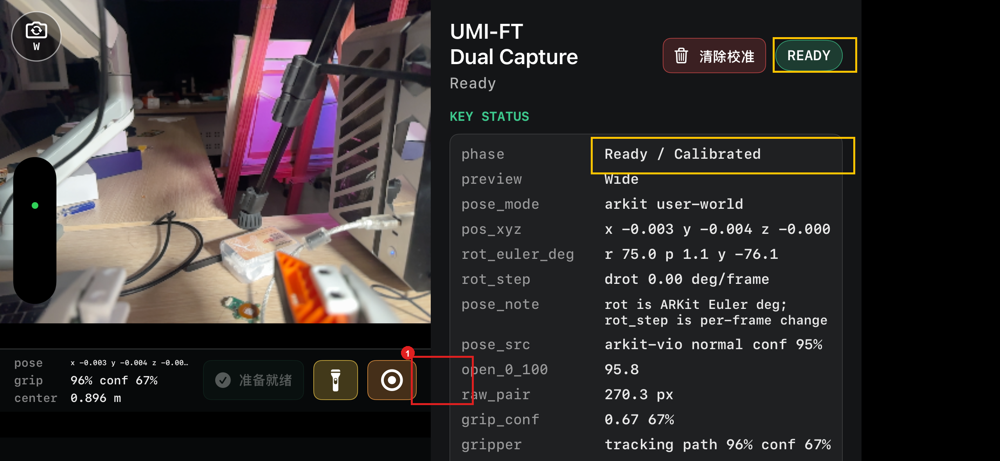

图 I-05：黄色区域显示 `READY` 和 `Ready / Calibrated`；红框 1 是右下角圆形录制按钮。

## 8. 正式开始录制

开始前同时检查：

1. iPhone App 显示 `Ready`。
2. 浏览器 iPhone 和 D435 画面持续更新。
3. 浏览器 CoinFT 两侧曲线持续更新。
4. 浏览器 `Gate` 没有设备断线、时间戳异常或 stale 错误。
5. 浏览器 Dataset 名称正确。

然后：

1. 在 iPhone 点击右下角圆形录制按钮。
2. App 显示 `3、2、1` 倒计时。
3. 倒计时结束后 App 进入 `Recording`。
4. 此时再开始执行任务动作。

动作开始后，按照任务本身自然、连续地完成接近、接触和后续操作：

- 接近目标时保持夹爪和目标处于腕部相机的有效视野中。
- 建立接触后继续按照实际任务需要施力或夹持，不需要为了配合相机刻意停顿。
- 动作完成前保持夹爪运动连续，结束后再点击停止按钮，避免有效操作被截断。

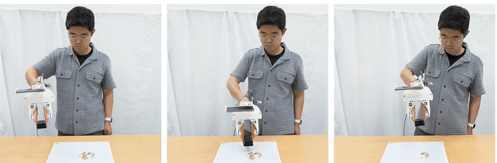

图 O-01：从左到右依次为接近目标、建立接触和继续完成操作。倒计时结束后再开始动作，并将三个阶段连续记录在同一个 Episode 中。

iPhone 的 `record_start` 会同时通知 Mac：

- 打开 D435 Episode 写盘。
- 打开 CoinFT 200 Hz 原始数据写盘。
- 保存 iPhone 权威 H.264 帧。
- 使用同一 canonical timestamp 记录 Episode 边界。

> 截图 I-06：Ready 页面。红框圈右下角圆形录制按钮。
>
> 截图 I-07：倒计时页面。红框圈倒计时数字。
>
> 截图 I-08：Recording 页面。红框圈 `Recording` 和红色 `Terminate` 按钮。
>
> 截图 B-07：浏览器录制状态。红框圈 Gate/Status 和 `D435 Recording`。

## 9. 正常结束一条录制

任务动作完成后：

1. 在 iPhone 点击右下角红色停止按钮。
2. App 返回 `Ready`。
3. 不要点击浏览器 `Stop`。
4. 等待浏览器 Recording Events 出现 `record_stop_committed`。
5. 等待后台 Normalize、Align 和质量检查完成。

D435 会在 stop 后额外写约 `0.5 s` 的 post-roll，再按 iPhone 的正式 stop timestamp 裁剪。这是正常行为。

> 截图 I-09：红框圈 `Terminate`。
>
> 截图 B-08：浏览器 Recording Events。红框圈 `record_stop_committed`。
>
> 截图 B-09：Derived/Postprocess 状态完成。

## 10. 在同一任务下连续录制多条 Episode

不需要再次点击 `Arm All`，也不需要重新选择 Dataset。

每条 Episode 都按以下循环：

```text
iPhone Ready
  -> 点击 Record
  -> 等待倒计时
  -> 执行任务
  -> 点击 Terminate
  -> 等待 App 返回 Ready
  -> 开始下一条
```

只要 App 没有退出、世界坐标没有失效、浏览器三路设备仍正常，就可以继续录制。

## 11. 切换录制任务或 Dataset

切换任务前必须先结束当前 Episode。

正确顺序：

1. 如果 iPhone 正在 Recording，先点击 `Terminate`。
2. 等待浏览器出现 `record_stop_committed`。
3. 在浏览器点击 `Stop`，关闭 iPhone receiver、D435 和 CoinFT。
4. 等待 Status 进入 idle/stopped，三路不再录制。
5. 创建新 Dataset，或从下拉框选择已有 Dataset 后点击 `Resume Dataset`。
6. 确认 Dataset 名称正确。
7. 点击 `Arm All` 重新点亮三路设备。
8. 检查 Gate 和三路画面后，再从 iPhone 开始录制。

不要在设备仍运行或 Episode 正在录制时强行切换 Dataset，系统会拒绝操作。

> 截图 B-10：红框 1 圈 `Stop`，红框 2 圈 Dataset 下拉框，红框 3 圈 `Resume Dataset`，红框 4 圈 `Arm All`。

## 12. 采集结束

1. 确认 iPhone 已经不在 Recording。
2. 等待最后一条 Episode 出现 `record_stop_committed`。
3. 点击浏览器 `Stop`。
4. 确认设备停止。
5. 回到终端按 `Control+C` 关闭网页服务。
6. 最后关闭 iPhone App、断开相机和传感器。

## 13. 常见错误

### 浏览器一直显示 Waiting for iPhone stream

- 确认 iPhone 已解锁并打开 App。
- 确认 USB 已连接并信任电脑。
- 确认 App 没有停留在系统权限弹窗。
- 点击浏览器 `Stop`，再点击 `Arm All`。

### Gate 显示 world origin not calibrated

这是手机尚未完成 World Cal。回到 iPhone 完成世界坐标标定，等待 App 显示 `Ready`。

### D435 没有画面

- 确认 D435 USB 已连接。
- 确认第一次使用时完成 sudo 安装。
- 普通恢复优先点击 `Stop`，再点击 `Arm All`。
- `Start D435 Preview` 只用于单路调试。

### CoinFT 没有曲线

- 确认 Teensy USB 已连接。
- 检查页面 CoinFT 状态是否显示正确串口。
- 普通恢复优先点击 `Stop`，再点击 `Arm All`。

### iPhone Record 按钮不可点击

必须先完成 Gripper Cal 和 World Cal，并让 App 进入 `Ready`。

### 点了 iPhone Record，但 Mac 没有开始写盘

检查浏览器 Gate / Exception。Mac 端门控失败时会拒绝正式 Episode，即使手机 UI 已进入 Recording，也不应继续执行任务。
